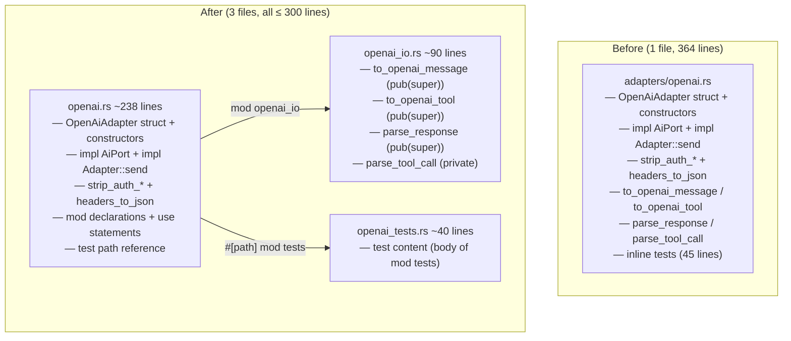

# Split OpenAI Adapter: IO Extraction and Test Separation

## Raw Requirement

> Line budgets — ≤ 300 lines for implementation files. adapters/openai.rs is 364
> lines and must be split to comply with the context budget policy.

## Description

`src/moeb/src/adapters/openai.rs` is 364 lines. Unlike `anthropic.rs`, its tests have
not yet been separated to a companion file — they are inline (lines 320–364). Two
extractions are therefore required:

1. **Test separation** — the inline `#[cfg(test)] mod tests { ... }` block is moved
   to a new `openai_tests.rs` companion file using the `#[path]` pattern established
   by `moeb.test-file-separation`.
2. **IO extraction** — the four serialisation and response-parsing helpers
   (`to_openai_message`, `to_openai_tool`, `parse_response`, `parse_tool_call`) are
   moved to a new `openai_io.rs` submodule.

After test separation alone, `openai.rs` is ~319 lines — still over budget. After
both extractions, `openai.rs` is ~238 lines. The three HTTP utilities
(`strip_auth_from_body`, `strip_auth_headers`, `headers_to_json`) are ~30 lines in
total and remain in `openai.rs` alongside `send()` where they are called, consistent
with the decision recorded in `moeb.split-anthropic-adapter`.

The existing inline tests do not reference any of the four moved functions, so no
re-export is required. No changes to test behaviour. No public API changes.

## Diagram



## Backlinks

### Parents

| Label | Path | Purpose |
|-------|------|---------|
| Context Budget Design | [specifications/moeb/moeb.context-budget-design.md](specifications/moeb/moeb.context-budget-design.md) | Established the 300-line source-file budget; this split eliminates adapters/openai.rs from the exceptions allowlist |
| Test File Separation | [specifications/moeb/moeb.test-file-separation.md](specifications/moeb/moeb.test-file-separation.md) | Established the `#[path]` companion-file pattern for test extraction; applied here to openai.rs |
| Split Anthropic Adapter | [specifications/moeb/moeb.split-anthropic-adapter.md](specifications/moeb/moeb.split-anthropic-adapter.md) | Established the adapter IO submodule pattern; HTTP utilities stay in the main file per Decision 1 of that spec |
| README | [README.md](../../README.md) | Root index |

### External

*(none)*

## Steps

### Step 1 — Create `src/moeb/src/adapters/openai_io.rs`

Read `src/moeb/src/adapters/openai.rs` in full. Create
`src/moeb/src/adapters/openai_io.rs` containing, in this order:

1. The imports required by the moved functions:

```rust
use anyhow::{Context, Result};
use serde_json::json;

use super::{AgentResponse, Message, ToolCall, ToolDef};
```

2. The `to_openai_message` function verbatim from `openai.rs`, with visibility
   changed to `pub(super)`.

3. The `to_openai_tool` function verbatim from `openai.rs`, with visibility changed
   to `pub(super)`.

4. The `parse_response` function verbatim from `openai.rs`, with visibility changed
   to `pub(super)`.

5. The `parse_tool_call` function verbatim from `openai.rs`. This function is private
   — it is only called by `parse_response` within this file.

### Step 2 — Create `src/moeb/src/adapters/openai_tests.rs`

Create `src/moeb/src/adapters/openai_tests.rs` containing the body of the existing
inline `mod tests { ... }` block verbatim — that is, everything between the opening
`{` and the closing `}` of `mod tests`, without the `mod tests` wrapper or the
`#[cfg(test)]` attribute. The file begins with the `use super::*;` line.

### Step 3 — Update `src/moeb/src/adapters/openai.rs`

Read `src/moeb/src/adapters/openai.rs` in full. Make the following changes:

**3a.** Remove from `openai.rs` the following items:
- `to_openai_message`
- `to_openai_tool`
- `parse_response`
- `parse_tool_call`
- The entire `#[cfg(test)] mod tests { ... }` inline block

**3b.** Add the module declaration and use statement for `openai_io` immediately
after the import block, before the constants:

```rust
mod openai_io;
use self::openai_io::{to_openai_message, to_openai_tool, parse_response};
```

**3c.** Add the test companion reference at the very end of the file:

```rust
#[cfg(test)]
#[path = "openai_tests.rs"]
mod tests;
```

**3d.** Remove any imports from `openai.rs` that are no longer referenced after the
removals in 3a. Keep all imports still used by the remaining functions.

### Step 4 — Verify

Run `cargo build --release` — zero errors. Run `cargo test` — all tests pass.

Confirm line counts:

```
(Get-Content src/moeb/src/adapters/openai.rs).Count
(Get-Content src/moeb/src/adapters/openai_io.rs).Count
(Get-Content src/moeb/src/adapters/openai_tests.rs).Count
```

`openai.rs` and `openai_io.rs` must be ≤ 300 lines. `openai_tests.rs` must be
≤ 400 lines.

Confirm moved functions are absent from `openai.rs`:

```
grep -n "^fn to_openai_message\|^fn to_openai_tool\|^fn parse_response\|^fn parse_tool_call" src/moeb/src/adapters/openai.rs
```

Must return no matches.

Confirm exactly one `#[cfg(test)]` line remains in `openai.rs` (the path reference):

```
grep -c "#\[cfg(test)\]" src/moeb/src/adapters/openai.rs
```

Must return `1`.

## Decisions

### Decision 1 — Both test separation and IO extraction are required in one spec

**Rationale:** Either extraction alone is insufficient. Removing only the inline
tests leaves `openai.rs` at ~319 lines — still over budget. Removing only the IO
helpers leaves inline tests, which is inconsistent with the `#[path]` pattern used
by all other modules in the kernel after `moeb.test-file-separation`. Since both
changes are needed and both touch only `openai.rs`, combining them in one
specification produces the minimum diff with no wasted intermediate state.

**Alternatives:**

| Option | Reason Rejected |
|--------|-----------------|
| Test separation only | openai.rs remains at ~319 lines; does not satisfy the 300-line budget |
| IO extraction only | Leaves inline tests inconsistent with the project-wide pattern |
| Two separate specs | Requires reading and writing openai.rs twice with no useful intermediate state |

**Consequences:** The executing agent completes both new-file creation steps (1, 2)
before updating `openai.rs` (Step 3), which is then written once with both removals
applied together.

---

### Decision 2 — HTTP utilities remain in `openai.rs`; no re-export needed

**Rationale:** Consistent with Decision 1 of `moeb.split-anthropic-adapter`. The
three HTTP utilities (`strip_auth_from_body`, `strip_auth_headers`, `headers_to_json`)
total ~30 lines and are called only inside `send()`. The existing tests do not
reference any of the four moved IO functions, so no `pub(crate) use` re-export is
needed — the private `use self::openai_io::...` in Step 3b is sufficient.

**Alternatives:**

| Option | Reason Rejected |
|--------|-----------------|
| Move HTTP utilities to `openai_io.rs` | Not needed to meet the 300-line budget; increases indirection for small helpers |
| Re-export moved functions from `openai.rs` | Tests do not reference them; a re-export would be dead code |

**Consequences:** `openai.rs` remains the HTTP transport layer. `openai_io.rs` is the
message-format layer. The split mirrors the `anthropic.rs` / `anthropic_request.rs` /
`anthropic_response.rs` structure, giving the two adapter files a consistent shape.

## Rubric

### Structured

| Name | Description | Threshold | Pass Condition |
|------|-------------|-----------|----------------|
| `binary-builds` | `cargo build --release` exits 0 | Zero errors | CI build exits 0 |
| `all-tests-pass` | `cargo test` exits 0 | Zero failures | `cargo test` exits 0 |
| `no-test-regression` | All existing openai adapter tests pass | Zero failures | `cargo test openai` exits 0 |
| `openai-rs-within-budget` | `openai.rs` is ≤ 300 lines | ≤ 300 lines | Line count check in Step 4 passes |
| `openai-io-rs-within-budget` | `openai_io.rs` is ≤ 300 lines | ≤ 300 lines | Line count check in Step 4 passes |
| `openai-tests-rs-within-budget` | `openai_tests.rs` is ≤ 400 lines | ≤ 400 lines | Line count check in Step 4 passes |
| `moved-fns-absent-from-openai-rs` | `to_openai_message`, `to_openai_tool`, `parse_response`, `parse_tool_call` not defined in `openai.rs` | Zero definitions | `grep` in Step 4 returns no matches |
| `inline-tests-absent-from-openai-rs` | Inline `mod tests` block removed; exactly one `#[cfg(test)]` line remains | Count = 1 | `grep -c` in Step 4 returns `1` |

### Qualitative

- **No behaviour change:** All moved functions must be byte-for-byte identical to their originals. Only visibility modifiers and import lines may change.
- **Test content unchanged:** The test functions in `openai_tests.rs` must be identical to the inline tests they replace. No test may be deleted, added, or modified.
- **Consistent adapter shape:** After this spec, both `openai.rs` and `anthropic.rs` follow the same structure — adapter struct and HTTP transport in the main file, serialisation/parsing in a submodule, tests in a companion file.
