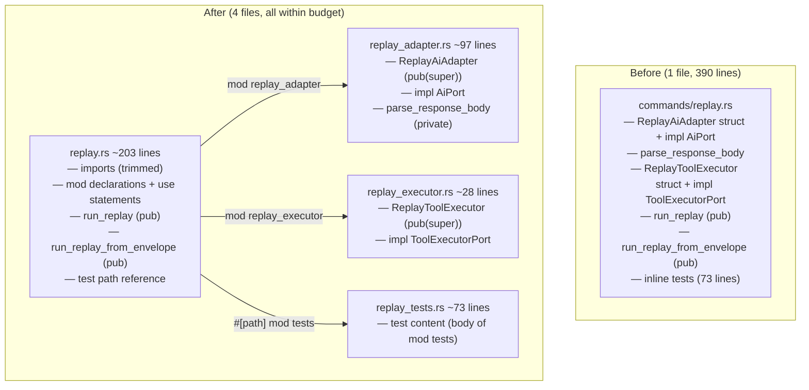

# Split Replay Command: Adapter, Executor, and Test Separation

## Raw Requirement

> Line budgets — ≤ 300 lines for implementation files. commands/replay.rs is 390
> lines and must be split to comply with the context budget policy.

## Description

`src/moeb/src/commands/replay.rs` is 390 lines. The file mixes four distinct concerns:
the `ReplayAiAdapter` struct with its `impl AiPort` and `parse_response_body` helper
(~97 lines), the `ReplayToolExecutor` struct with its `impl ToolExecutorPort` (~28
lines), the two public entry-point functions `run_replay` and `run_replay_from_envelope`
(~178 lines), and an inline test block (~73 lines).

Three extractions are required:

1. **Adapter extraction** — `ReplayAiAdapter`, its `impl AiPort`, and the private
   `parse_response_body` helper are moved to a new `replay_adapter.rs` submodule.
2. **Executor extraction** — `ReplayToolExecutor` and its `impl ToolExecutorPort` are
   moved to a new `replay_executor.rs` submodule.
3. **Test separation** — the inline `#[cfg(test)] mod tests { ... }` block is moved
   to a new `replay_tests.rs` companion file using the `#[path]` pattern established
   by `moeb.test-file-separation`.

After all three extractions, `replay.rs` is ~203 lines. The two public entry-point
functions remain in `replay.rs` where they are defined and exported.

No behaviour changes. No public API changes.

## Diagram



## Backlinks

### Parents

| Label | Path | Purpose |
|-------|------|---------|
| Context Budget Design | [specifications/moeb/moeb.context-budget-design.md](specifications/moeb/moeb.context-budget-design.md) | Established the 300-line source-file budget; this split eliminates commands/replay.rs from the exceptions allowlist |
| Test File Separation | [specifications/moeb/moeb.test-file-separation.md](specifications/moeb/moeb.test-file-separation.md) | Established the `#[path]` companion-file pattern for test extraction; applied here to replay.rs |
| Split Anthropic Adapter | [specifications/moeb/moeb.split-anthropic-adapter.md](specifications/moeb/moeb.split-anthropic-adapter.md) | Established the adapter IO submodule pattern; consistent structure applied here |
| README | [README.md](../../README.md) | Root index |

### External

*(none)*

## Steps

### Step 1 — Create `src/moeb/src/commands/replay_adapter.rs`

Read `src/moeb/src/commands/replay.rs` in full. Create
`src/moeb/src/commands/replay_adapter.rs` containing, in this order:

1. The imports required by the moved items:

```rust
use anyhow::{Context, Result};
use std::collections::VecDeque;

use crate::adapters::{AgentResponse, Message, ToolDef};
use crate::ports::AiPort;
```

2. The `ReplayAiAdapter` struct verbatim from `replay.rs`, with visibility changed to
   `pub(super)`.

3. The `impl ReplayAiAdapter` block verbatim from `replay.rs`. The `new` constructor
   visibility is unchanged (private — no `pub` was on it).

4. The `impl AiPort for ReplayAiAdapter` block verbatim from `replay.rs`. The `send`
   method calls `parse_response_body` which is defined in the same file.

5. The `parse_response_body` function verbatim from `replay.rs`. This function is
   private — it is only called by `ReplayAiAdapter::send` within this file. The
   function body references `crate::adapters::ToolCall` using its absolute path, which
   remains valid in the submodule; no import change is needed for it.

### Step 2 — Create `src/moeb/src/commands/replay_executor.rs`

Create `src/moeb/src/commands/replay_executor.rs` containing, in this order:

1. The imports required by the moved items:

```rust
use anyhow::Result;
use std::collections::HashMap;

use crate::ports::ToolExecutorPort;
```

2. The `ReplayToolExecutor` struct verbatim from `replay.rs`, with visibility changed
   to `pub(super)`.

3. The `impl ReplayToolExecutor` block verbatim from `replay.rs`. The `new` constructor
   is unchanged (private).

4. The `impl ToolExecutorPort for ReplayToolExecutor` block verbatim from `replay.rs`.

### Step 3 — Create `src/moeb/src/commands/replay_tests.rs`

Create `src/moeb/src/commands/replay_tests.rs` containing the body of the existing
inline `mod tests { ... }` block verbatim — that is, everything between the opening
`{` and the closing `}` of `mod tests`, without the `mod tests` wrapper or the
`#[cfg(test)]` attribute. The file begins with the `use super::*;` line and includes
the explicit `use crate::trace::{...}` import that follows it.

### Step 4 — Update `src/moeb/src/commands/replay.rs`

Read `src/moeb/src/commands/replay.rs` in full. Make the following changes:

**4a.** Remove from `replay.rs` the following items:
- `ReplayAiAdapter` struct and both its `impl` blocks (`impl ReplayAiAdapter` and
  `impl AiPort for ReplayAiAdapter`)
- `parse_response_body`
- `ReplayToolExecutor` struct and both its `impl` blocks (`impl ReplayToolExecutor`
  and `impl ToolExecutorPort for ReplayToolExecutor`)
- The entire `#[cfg(test)] mod tests { ... }` inline block
- The three section-comment lines (`// ── ReplayAiAdapter ...`, `// ── ReplayToolExecutor ...`,
  `// ── Tests ...`)

**4b.** Remove the imports that are no longer referenced after the removals in 4a:

- Remove `AgentResponse` from the `crate::adapters` import (keep `Message` and
  `ToolDef`, which are still used by `run_replay_from_envelope`)
- Remove the `use crate::ports::AiPort;` line entirely
- Remove the `use crate::ports::ToolExecutorPort;` line entirely

The resulting import block is:

```rust
use anyhow::{Context, Result};
use std::collections::{HashMap, VecDeque};
use std::sync::Arc;

use crate::adapters::{Message, ToolDef};
use crate::agent::run_agent_loop_traced;
use crate::trace::{
    AgentFinishReason, FileContentMode, TraceCommand, TraceConfig, TraceContext, TraceEnvelope,
    TraceEvent,
};
```

**4c.** Add the module declarations and use statements immediately after the import
block, before `run_replay`:

```rust
mod replay_adapter;
use self::replay_adapter::ReplayAiAdapter;

mod replay_executor;
use self::replay_executor::ReplayToolExecutor;
```

**4d.** Add the test companion reference at the very end of the file:

```rust
#[cfg(test)]
#[path = "replay_tests.rs"]
mod tests;
```

**4e.** No other changes to `replay.rs`. The call sites `Arc::new(ReplayAiAdapter::new(responses))`
and `ReplayToolExecutor::new(results)` in `run_replay_from_envelope` continue to
resolve via the `use` declarations added in 4c.

### Step 5 — Verify

Run `cargo build --release` — zero errors. Run `cargo test` — all tests pass.

Confirm line counts:

```
(Get-Content src/moeb/src/commands/replay.rs).Count
(Get-Content src/moeb/src/commands/replay_adapter.rs).Count
(Get-Content src/moeb/src/commands/replay_executor.rs).Count
(Get-Content src/moeb/src/commands/replay_tests.rs).Count
```

`replay.rs` and `replay_adapter.rs` must be ≤ 300 lines. `replay_executor.rs` must
be ≤ 300 lines. `replay_tests.rs` must be ≤ 400 lines.

Confirm moved structs are absent from `replay.rs`:

```
grep -n "^struct ReplayAiAdapter\|^struct ReplayToolExecutor\|^fn parse_response_body" src/moeb/src/commands/replay.rs
```

Must return no matches.

Confirm exactly one `#[cfg(test)]` line remains in `replay.rs` (the path reference):

```
grep -c "#\[cfg(test)\]" src/moeb/src/commands/replay.rs
```

Must return `1`.

## Decisions

### Decision 1 — Three extractions combined in one spec

**Rationale:** Each extraction alone is insufficient. `replay.rs` after test-only
separation is ~317 lines — still over budget. After adapter-only extraction it is ~293
lines — borderline and leaves `ReplayToolExecutor` in the wrong file for a clean
separation of concerns. Combining all three in one spec produces the minimum diff with
no wasted intermediate state and results in three focused files each under budget.

**Alternatives:**

| Option | Reason Rejected |
|--------|-----------------|
| Test separation only | replay.rs remains at ~317 lines; does not satisfy the 300-line budget |
| Adapter extraction only | replay.rs at ~293 lines; leaves ReplayToolExecutor still mixed in with run functions |
| Three separate specs | Requires reading and writing replay.rs three times with no useful intermediate state |

**Consequences:** The executing agent creates all three new files (Steps 1–3) before
updating `replay.rs` (Step 4), which is then written once with all removals applied
together.

---

### Decision 2 — `ReplayAiAdapter` and `parse_response_body` go together in `replay_adapter.rs`

**Rationale:** `parse_response_body` is called exclusively inside
`ReplayAiAdapter::send`. Moving it to the same file as `ReplayAiAdapter` keeps the
call site and definition co-located and avoids exposing a private parsing helper to
the parent module. Making `parse_response_body` private in `replay_adapter.rs` is
correct — it is an implementation detail of the adapter, not of the replay command.

**Alternatives:**

| Option | Reason Rejected |
|--------|-----------------|
| Keep `parse_response_body` in `replay.rs` | Creates a cross-file call from `replay_adapter.rs` back to `super::parse_response_body`; unnecessary coupling for a private helper |
| Extract `parse_response_body` to its own module | Adds a third module for a single 70-line function; disproportionate overhead |

**Consequences:** `replay_adapter.rs` is a self-contained AI stub: it owns both the
struct and the response-parsing logic it depends on. `ReplayToolExecutor` is
independent and goes to its own file.

---

### Decision 3 — `ReplayAiAdapter` and `ReplayToolExecutor` are `pub(super)`, constructors are private

**Rationale:** Both types are instantiated in `run_replay_from_envelope` in `replay.rs`,
so the struct names must be visible to the parent. `pub(super)` gives exactly that
visibility — the structs are accessible within the `commands::replay` module but not
outside it. The `new` constructors are not needed outside the module, so they remain
private (no `pub`) matching their current visibility.

**Alternatives:**

| Option | Reason Rejected |
|--------|-----------------|
| `pub` on structs | Unnecessarily wide; no caller outside `commands::replay` |
| `pub(crate)` on structs | Wider than needed; no caller outside the module after the split |

**Consequences:** Both submodules (`replay_adapter`, `replay_executor`) are private
to the `commands::replay` module. Nothing outside `commands/replay.rs` can access
`ReplayAiAdapter` or `ReplayToolExecutor` directly.

## Rubric

### Structured

| Name | Description | Threshold | Pass Condition |
|------|-------------|-----------|----------------|
| `binary-builds` | `cargo build --release` exits 0 | Zero errors | CI build exits 0 |
| `all-tests-pass` | `cargo test` exits 0 | Zero failures | `cargo test` exits 0 |
| `no-test-regression` | All existing replay tests pass | Zero failures | `cargo test replay` exits 0 |
| `replay-rs-within-budget` | `replay.rs` is ≤ 300 lines | ≤ 300 lines | Line count check in Step 5 passes |
| `replay-adapter-rs-within-budget` | `replay_adapter.rs` is ≤ 300 lines | ≤ 300 lines | Line count check in Step 5 passes |
| `replay-executor-rs-within-budget` | `replay_executor.rs` is ≤ 300 lines | ≤ 300 lines | Line count check in Step 5 passes |
| `replay-tests-rs-within-budget` | `replay_tests.rs` is ≤ 400 lines | ≤ 400 lines | Line count check in Step 5 passes |
| `moved-types-absent-from-replay-rs` | `ReplayAiAdapter`, `ReplayToolExecutor`, `parse_response_body` not defined in `replay.rs` | Zero definitions | `grep` in Step 5 returns no matches |
| `inline-tests-absent-from-replay-rs` | Inline `mod tests` block removed; exactly one `#[cfg(test)]` line remains | Count = 1 | `grep -c` in Step 5 returns `1` |

### Qualitative

- **No behaviour change:** All moved items must be byte-for-byte identical to their originals. Only visibility modifiers (`pub(super)`) and import lines may change.
- **Test content unchanged:** The test functions in `replay_tests.rs` must be identical to the inline tests they replace. No test may be deleted, added, or modified.
- **Consistent adapter shape:** After this spec, `replay.rs` follows the same structure as `anthropic.rs` and `openai.rs` — entry-point functions in the main file, protocol concerns in submodules, tests in a companion file.
