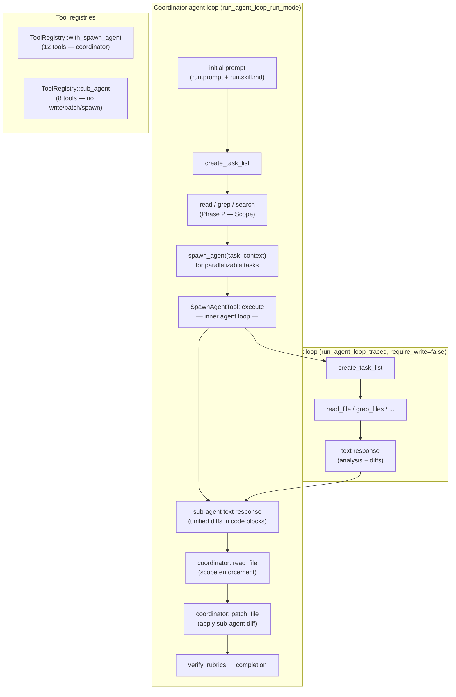

# Sub-Agent Spawning

## Raw Requirement

> For a single spec run, I would like that write should be performed through the
> coordinator (or parent) agent. Could we preface or cause the agent to act according
> to a specified role? Could they be implemented as an AI Skill (so workflow of steps
> for the known request)?

## Description

A single `moeb run` executes all specification steps with one agent and one growing
conversation history. For complex specifications touching many independent files, the
growing history imposes unnecessary token cost on every adapter call. Sub-agent spawning
addresses this by letting the coordinator delegate bounded analysis tasks — read a set
of files, propose a unified diff — to short-lived sub-agents that run in their own
isolated conversation context.

This specification introduces a `spawn_agent` tool. The coordinator calls it with a
task description and context string; the kernel starts a new agent loop with a
restricted tool set (read tools + task-list tools, no write or spawn), waits for the
sub-agent to return a text response containing unified diffs, and returns that text to
the coordinator. The coordinator then applies each diff to the relevant file using
`patch_file` (which it must read first to satisfy scope enforcement).

Sub-agent spawning is sequential in this first implementation — the coordinator blocks
until each spawned agent completes before spawning the next. Parallel execution is
deferred to a later specification.

**Coordinator-only writes** remain the invariant confirmed by the user: sub-agents
cannot call `write_file`, `patch_file`, or `spawn_agent`. Only the coordinator holds
those tools.

## Diagram



## Backlinks

### Parents

| Label | Path | Purpose |
|-------|------|---------|
| Patch File Tool | [specifications/moeb/moeb.patch-file-tool.md](specifications/moeb/moeb.patch-file-tool.md) | Prerequisite — patch_file tool that the coordinator uses to apply sub-agent diffs |
| Agent Skills | [specifications/moeb/moeb.agent-skills.md](specifications/moeb/moeb.agent-skills.md) | Established binary-bundled skill files and {{skill_content}} injection; sub-agent.skill.md follows the same pattern |
| Run-Time File Scope Enforcement | [specifications/moeb/moeb.run-file-scope-enforcement.md](specifications/moeb/moeb.run-file-scope-enforcement.md) | Coordinator must read a file before patching it (scope enforcement still applies) |
| README | [README.md](../../README.md) | Root index |

### External

*(none)*

## Steps

### Step 1 — Create `src/moeb/assets/skills/sub-agent.skill.md`

Create the file with the following content verbatim:

```markdown
IMPORTANT — Your FIRST action must be a tool call. Do not narrate or plan in text
before calling tools. Your FINAL output must be a text response — you cannot call
write_file or patch_file. Return your analysis and any proposed file changes as unified
diffs inside ```diff code blocks.

## Phase 1 — Understand and plan

Call `create_task_list` as your first tool call. List one task per file or logical
change you need to analyze. Keep the task list short and focused on the work described
in the task and context you were given.

## Phase 2 — Read and analyze

For each task, use the read tools to gather the information you need:

- `read_file_range` — preferred for targeted sections when you know the line range
- `grep_files` — locate symbols, function names, or patterns in the source tree
- `read_file` — full file content when you must propose a complete replacement
- `read_files` — multiple files in one call when all are needed
- `list_directory`, `search_files` — discover file structure when paths are unknown

Call `update_task` with `status: "done"` after completing each analysis task.

## Phase 3 — Compose diffs

For each file that needs changing, produce a unified diff. Rules:

1. The diff must be in standard unified format: `--- a/path`, `+++ b/path`,
   `@@ -N,M +N,M @@` hunk headers, lines prefixed with `-`, `+`, or space.
2. Wrap each diff in a ```diff code block.
3. Precede each diff with one sentence explaining what it changes and why.
4. If a change is too large for a diff (full file replacement), include the complete
   new content in a ```rust (or appropriate language) code block with a `// FILE:
   path` comment on the first line.

## Phase 4 — Return your response

Your response must contain, in order:

1. A one-paragraph summary of your findings.
2. Each proposed diff or replacement, labelled by file path.
3. Nothing else — no further prose, no implementation steps for the coordinator.

The coordinator will apply your diffs using `patch_file`.
```

### Step 2 — Update `src/moeb/assets/skills/run.skill.md`

Read `src/moeb/assets/skills/run.skill.md` in full. Insert the following new section
immediately after the `## Phase 1 — Plan` section (after the `create_task_list`
paragraph) and before `## Phase 2 — Scope`:

```markdown
## Phase 1a — Delegate (optional)

After creating your task list, identify tasks that are **independent and
analysis-heavy** (reading multiple files to propose a diff with no ordering dependency
on other tasks). For each such task, call `spawn_agent` instead of doing the work
inline:

- `task` — one precise instruction: which files to read and what diff to produce.
- `context` — the spec steps, file paths, and constraints the sub-agent needs.

`spawn_agent` is synchronous: it blocks until the sub-agent returns its text response.
Process sub-agents one at a time.

**Applying a sub-agent diff:**

1. Call `read_file` on the file the sub-agent proposes to change (required for scope
   enforcement — the coordinator must have read a file before patching it).
2. Call `patch_file` with the unified diff from the sub-agent's response.
3. Mark the corresponding coordinator task as done.

Do not spawn a sub-agent for tasks that require writing new files that do not yet exist
(scope enforcement is bypassed for new files, so write them directly) or for tasks
that depend on the output of a prior task's write.
```

No other changes to `run.skill.md`.

### Step 3 — Create `src/moeb/src/tools/spawn_agent.rs`

Create the file with the following content:

```rust
use std::path::Path;
use std::sync::Arc;
use anyhow::{Context, Result};
use serde_json::json;

use crate::adapters::ToolDef;
use crate::ports::AiPort;
use super::ToolHandler;

pub const MAX_SUB_AGENT_TURNS: usize = 20;

pub struct SpawnAgentTool {
    pub adapter: Arc<dyn AiPort>,
}

impl ToolHandler for SpawnAgentTool {
    fn name(&self) -> &'static str { "spawn_agent" }

    fn definition(&self) -> ToolDef {
        ToolDef {
            name: "spawn_agent",
            description: "Spawn a sub-agent to analyze files and return a unified diff. \
                The sub-agent can read files and use task-list tools but cannot write, \
                patch, or spawn further agents. Use this to delegate independent \
                analysis tasks. spawn_agent is synchronous — it blocks until the \
                sub-agent returns its text response.",
            parameters: json!({
                "type": "object",
                "properties": {
                    "task": {
                        "type": "string",
                        "description": "Precise instruction for the sub-agent: which files \
                            to read and what unified diff to produce."
                    },
                    "context": {
                        "type": "string",
                        "description": "Relevant specification steps, file paths, and \
                            architectural constraints the sub-agent needs to complete \
                            its analysis."
                    }
                },
                "required": ["task", "context"]
            }),
        }
    }

    fn execute(&self, args: &serde_json::Value, working_dir: &Path) -> Result<String> {
        let task = args["task"].as_str().context("spawn_agent: missing 'task'")?;
        let context = args["context"].as_str().context("spawn_agent: missing 'context'")?;

        let moeb_dir = working_dir.join(".moeb");
        let sub_skill = crate::skills::load_skill(&moeb_dir, "sub-agent");
        let role_name = "run";
        let role_content = crate::skills::load_role(&moeb_dir, role_name);

        let prompt = format!(
            "{}\n\n=== Task ===\n{}\n\n=== Context ===\n{}\n\n{}",
            role_content, task, context, sub_skill
        );

        let state = crate::run_state::new_shared_run_state();
        let registry = super::ToolRegistry::sub_agent(Arc::clone(&state));
        let tool_defs = registry.definitions();
        let executor = super::RealToolExecutor::new_sub_agent(Arc::clone(&state));
        let noop_trace = Arc::new(crate::trace::TraceContext::new(crate::trace::TraceConfig {
            command: crate::trace::TraceCommand::Run,
            spec: String::new(),
            adapter: String::new(),
            model: String::new(),
            retention: 0,
            file_content_mode: crate::trace::FileContentMode::Embed,
        }));

        let initial_messages = vec![crate::adapters::Message::User(prompt)];
        let result = crate::agent::run_agent_loop_traced(
            self.adapter.as_ref(),
            &executor,
            &tool_defs,
            working_dir,
            initial_messages,
            MAX_SUB_AGENT_TURNS,
            &noop_trace,
            1,
            crate::agent::CompactionConfig::default(),
            state,
        )?;

        if result.is_empty() {
            return Ok(
                "[spawn_agent] Sub-agent returned no output. \
                 The sub-agent may have reached its turn limit without completing analysis. \
                 Perform this task directly.".to_string()
            );
        }

        Ok(result)
    }
}
```

### Step 4 — Extend `ToolRegistry` in `src/moeb/src/tools/mod.rs`

Read `src/moeb/src/tools/mod.rs` in full. Make the following three additive changes:

**4a.** Add `pub mod spawn_agent;` to the module declarations at the top of the file,
in alphabetical order with the other `pub mod` lines.

**4b.** Add two new factory methods to the `impl ToolRegistry` block, after `standard`:

```rust
/// Register the eight sub-agent tools (six read tools + task-list, no write/patch/spawn).
pub fn sub_agent(state: SharedRunState) -> Self {
    let mut r = Self::new();
    r.register(Box::new(read_file::ReadFileTool));
    r.register(Box::new(read_files::ReadFilesTool));
    r.register(Box::new(read_file_range::ReadFileRangeTool));
    r.register(Box::new(list_directory::ListDirectoryTool));
    r.register(Box::new(search_files::SearchFilesTool));
    r.register(Box::new(grep_files::GrepFilesTool));
    r.register(Box::new(create_task_list::CreateTaskListTool { state: std::sync::Arc::clone(&state) }));
    r.register(Box::new(update_task::UpdateTaskTool { state: std::sync::Arc::clone(&state) }));
    r
}

/// Register the twelve coordinator tools (eleven standard tools + spawn_agent).
pub fn with_spawn_agent(state: SharedRunState, adapter: std::sync::Arc<dyn crate::ports::AiPort>) -> Self {
    let mut r = Self::standard(std::sync::Arc::clone(&state));
    r.register(Box::new(spawn_agent::SpawnAgentTool { adapter }));
    r
}
```

**4c.** In the `definitions()` method, add `"spawn_agent"` to the end of the `order`
array:

```rust
let order = [
    "read_file", "write_file", "patch_file", "list_directory",
    "search_files", "grep_files", "read_files", "read_file_range",
    "create_task_list", "update_task", "verify_rubrics", "spawn_agent",
];
```

### Step 5 — Add `new_sub_agent` and `new_coordinator` constructors to `RealToolExecutor`

In `src/moeb/src/tools/mod.rs`, in the `impl RealToolExecutor` block, add the following
two constructors immediately after the existing `pub fn new` constructor:

```rust
pub fn new_sub_agent(state: SharedRunState) -> Self {
    Self {
        registry: ToolRegistry::sub_agent(std::sync::Arc::clone(&state)),
        cache: Mutex::new(HashMap::new()),
        read_paths: Mutex::new(std::collections::HashSet::new()),
        state,
    }
}

pub fn new_coordinator(
    state: SharedRunState,
    adapter: std::sync::Arc<dyn crate::ports::AiPort>,
) -> Self {
    Self {
        registry: ToolRegistry::with_spawn_agent(std::sync::Arc::clone(&state), adapter),
        cache: Mutex::new(HashMap::new()),
        read_paths: Mutex::new(std::collections::HashSet::new()),
        state,
    }
}
```

### Step 6 — Update `src/moeb/src/domain/run.rs`

Read `src/moeb/src/domain/run.rs` in full. In the `run` method, replace the two lines
that create `tools` and `executor` from `ToolRegistry::standard` and
`RealToolExecutor::new`:

```rust
let tools = crate::tools::ToolRegistry::standard(std::sync::Arc::clone(&state)).definitions();
let executor = crate::tools::RealToolExecutor::new(std::sync::Arc::clone(&state));
```

with:

```rust
let tools = crate::tools::ToolRegistry::with_spawn_agent(
    std::sync::Arc::clone(&state),
    std::sync::Arc::clone(&ai),
).definitions();
let executor = crate::tools::RealToolExecutor::new_coordinator(
    std::sync::Arc::clone(&state),
    std::sync::Arc::clone(&ai),
);
```

No other changes to `run.rs`.

### Step 7 — Verify

Run `cargo build --release` — zero errors. Run `cargo test` — all tests pass.

Confirm the new asset file exists:

```
ls src/moeb/assets/skills/sub-agent.skill.md
```

Confirm `spawn_agent` is in the coordinator definitions by checking the order array:

```
grep -n "spawn_agent" src/moeb/src/tools/mod.rs
```

Confirm the sub-agent registry is write-free — it must contain none of `write_file`,
`patch_file`, or `spawn_agent`:

```
grep -A 20 "fn sub_agent" src/moeb/src/tools/mod.rs
```

Confirm `domain/run.rs` uses the coordinator executor:

```
grep "new_coordinator" src/moeb/src/domain/run.rs
```

## Decisions

### Decision 1 — Sequential spawning for MVP; parallel deferred

**Rationale:** Parallel sub-agent execution requires a thread-safe mechanism for the
coordinator to wait on multiple futures and collect results in a deterministic order.
The current agent loop is synchronous and single-threaded. Introducing `tokio::spawn`
or `std::thread::spawn` with channel collection adds significant complexity and
requires the adapters (which use `reqwest` blocking client) to be made `Send + Sync`
across OS threads. Sequential spawning (one sub-agent completes before the next
starts) requires zero concurrency machinery and already reduces context size for the
coordinator because each sub-agent analysis stays in its own isolated history.

**Alternatives:**

| Option | Reason Rejected |
|--------|-----------------|
| Parallel via OS threads | Requires adapters to be `Send`, reqwest blocking client is not designed for multi-thread use; significant risk of data races in trace |
| Parallel via tokio | Requires async refactor of the entire agent loop and adapters; large scope, separate specification |
| No sub-agents; compaction only | Compaction reduces history size but does not reduce per-sub-task analysis load; sub-agents provide context isolation |

**Consequences:** Sub-agents execute one at a time. The coordinator must sequence
`spawn_agent` calls. Total wall-clock time is not reduced in MVP; the benefit is
context isolation per analysis task.

---

### Decision 2 — Sub-agents return text with unified diffs; coordinator applies patches

**Rationale:** Giving sub-agents write access would require the coordinator to
synchronize writes (two sub-agents writing the same file concurrently = corruption) and
would eliminate the coordinator's opportunity to review the change before it lands.
Having sub-agents return diffs as text keeps the coordinator in control of the file
system, consistent with the user's stated requirement ("write should be performed
through the coordinator"). The diff format is machine-readable and can be applied
atomically by `patch_file`.

**Alternatives:**

| Option | Reason Rejected |
|--------|-----------------|
| Sub-agents call write_file | Violates coordinator-only write policy; concurrency conflicts in sequential MVP are avoidable but parallel future requires it anyway |
| Sub-agents return full file content | Larger payloads; coordinator cannot easily identify what changed; patch_file is designed exactly for this case |
| Sub-agents call patch_file via coordinator proxy | Unnecessary indirection; returning the diff text is simpler |

**Consequences:** The coordinator must call `read_file` on each file before applying a
sub-agent diff (to satisfy scope enforcement). This is a deliberate design: the
coordinator reviews the current file content before committing the sub-agent's proposed
change.

---

### Decision 3 — Sub-agent gets its own isolated `RunState`

**Rationale:** The coordinator's `RunState` holds its task list and rubric verdicts for
the outer run. A sub-agent that calls `create_task_list` should not overwrite the
coordinator's task list, and a sub-agent's `update_task` calls should not affect the
coordinator's progress tracking. Giving each sub-agent its own `new_shared_run_state()`
provides complete isolation at zero coordination cost.

**Alternatives:**

| Option | Reason Rejected |
|--------|-----------------|
| Shared RunState | create_task_list from sub-agent overwrites coordinator plan; update_task corrupts coordinator progress |
| No create_task_list for sub-agents | Removing planning tools reduces sub-agent quality; tool is cheap and useful for structured analysis |

**Consequences:** Sub-agent task lists are ephemeral — they live only for the duration
of the sub-agent loop and are discarded when `spawn_agent` returns. Coordinator task
list is unaffected.

---

### Decision 4 — No recursive spawning; sub-agent registry omits `spawn_agent`

**Rationale:** Recursive spawning requires depth tracking, cycle detection, and
bounded resource accounting. None of that machinery exists. The simplest prevention is
the most robust: the sub-agent registry (`ToolRegistry::sub_agent`) does not include
`spawn_agent`, so the model cannot call it even if the skill says to. This is a
hard constraint, not a soft instruction.

**Alternatives:**

| Option | Reason Rejected |
|--------|-----------------|
| Allow one level of recursion | Adds depth tracking complexity; sub-agent tasks are deliberately bounded; one level is sufficient |
| Instruction-only prevention (skill says "don't spawn") | Model may still call the tool; registry omission is a hard enforcement |

**Consequences:** Sub-agents cannot spawn further sub-agents. If a sub-agent task is
itself compound, the coordinator must break it into smaller `spawn_agent` calls or
perform the work inline.

---

### Decision 5 — Coordinator must `read_file` before `patch_file` on sub-agent diffs

**Rationale:** Scope enforcement (`moeb.run-file-scope-enforcement`) requires that
`patch_file` on an existing file is rejected unless the coordinator has previously
called `read_file` on it during the current run. This invariant was deliberately
preserved in `moeb.patch-file-tool` (Decision 2 of that spec). Sub-agent analysis
bypasses the coordinator's read history — the sub-agent reads the file, not the
coordinator. Requiring the coordinator to re-read before patching ensures the
coordinator actually sees the current file content before committing a change, adding a
natural review step.

**Alternatives:**

| Option | Reason Rejected |
|--------|-----------------|
| Exempt patch_file from scope enforcement when applying sub-agent diffs | Weakens the enforcement invariant; coordinator could patch stale content |
| Have spawn_agent pre-populate coordinator read_paths | Coupling between executor state and tool internals; violates isolation between coordinator and sub-agent |

**Consequences:** The coordinator always performs `read_file` → `patch_file` for any
file a sub-agent proposes to change. This is documented in both `run.skill.md`
Phase 1a and the `spawn_agent` tool description.

## Rubric

### Structured

| Name | Description | Threshold | Pass Condition |
|------|-------------|-----------|----------------|
| `binary-builds` | `cargo build --release` exits 0 | Zero errors | CI build exits 0 |
| `all-tests-pass` | `cargo test` exits 0 | Zero failures | `cargo test` exits 0 |
| `spawn-agent-in-coordinator-registry` | `spawn_agent` appears in `ToolRegistry::with_spawn_agent().definitions()` | Present | `grep spawn_agent src/moeb/src/tools/mod.rs` shows order array entry and factory method |
| `sub-agent-registry-is-write-free` | `ToolRegistry::sub_agent()` contains none of `write_file`, `patch_file`, or `spawn_agent` | Zero write/patch/spawn entries | `grep -A 20 "fn sub_agent" src/moeb/src/tools/mod.rs` shows only read + task-list tools |
| `coordinator-executor-in-run-rs` | `domain/run.rs` uses `new_coordinator` | Present | `grep new_coordinator src/moeb/src/domain/run.rs` returns a match |
| `sub-agent-skill-bundled` | `sub-agent.skill.md` exists as a binary asset | File present | `ls src/moeb/assets/skills/sub-agent.skill.md` succeeds |

### Qualitative

- **No recursive spawning:** `spawn_agent` must not appear in `ToolRegistry::sub_agent()`. Verify by inspection of the `sub_agent` factory method.
- **Coordinator-only writes:** A sub-agent run (invoked by `SpawnAgentTool::execute`) that calls `write_file` or `patch_file` must receive an "Unknown tool" error from the sub-agent's executor. Verify by inspection of `ToolRegistry::sub_agent` — those handlers must be absent.
- **Empty-response guard:** If `run_agent_loop_traced` returns an empty string for the sub-agent, `SpawnAgentTool::execute` must return a non-empty fallback message instructing the coordinator to perform the task directly. Verify by reading `spawn_agent.rs`.
- **Phase 1a in run.skill.md:** The updated `run.skill.md` must contain the `## Phase 1a — Delegate (optional)` section with `spawn_agent` usage instructions. Verify by reading the asset file.
