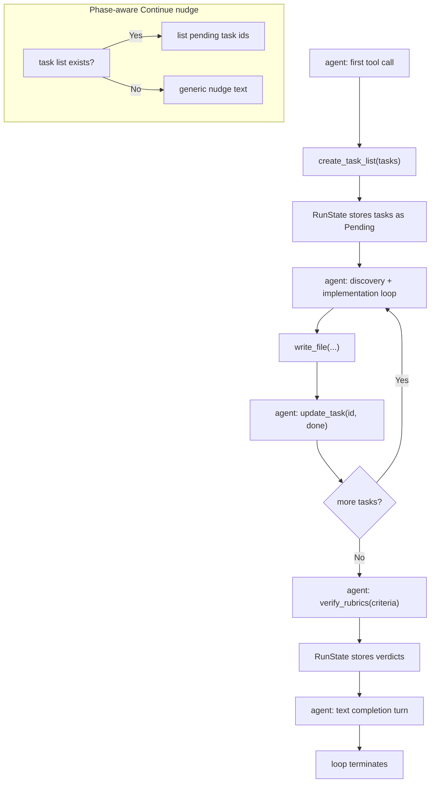

# Task-List Tools

## Raw Requirement

> The current agent loop has no structured planning phase — run.prompt explicitly
> forbids any text turn before the first tool call, so the agent dives directly into
> discovery with no committed plan and no kernel-visible record of what it intends to
> do. The kernel's "Continue" nudge is stateless and generic. Introduce structured
> workflow tools so the agent commits its plan upfront, marks tasks done as it proceeds,
> and explicitly verifies rubric criteria before completing a run.

## Description

This specification adds three new tools to the kernel — `create_task_list`,
`update_task`, and `verify_rubrics` — and the shared per-run state they operate on.
Together they give the agent a structured workflow without requiring a text planning turn
(which the loop forbids), and they give the kernel real task state to surface in the
phase-aware "Continue" nudge.

**`create_task_list`** is called by the agent as its very first tool invocation. It
records a numbered list of tasks derived from the specification's Steps section. The
kernel stores this list in a `RunState` struct shared across the run.

**`update_task`** is called after each task is completed. It transitions a task from
`Pending` to `Done` or `Skipped` in `RunState`.

**`verify_rubrics`** is called as the final tool invocation before the agent's
completion text turn. It records a pass / fail / na verdict for each structured rubric
criterion from the specification's `## Rubric` section.

A new `src/moeb/src/run_state.rs` module defines `RunState` and its supporting types.
`RunState` is wrapped in `Arc<Mutex<RunState>>` and shared between `RealToolExecutor`
(which processes the tool calls) and `run_agent_loop_inner` (which builds the
"Continue" nudge). When a task list exists, the nudge lists remaining pending tasks by
id and description instead of the current generic text. If `write_file` is called
without a prior `create_task_list`, `RealToolExecutor` emits a stderr warning but does
not block the write.

`run.prompt` receives three additive changes: a step 0 instructing `create_task_list`
before discovery, an `update_task` call after each completed step, and a
`verify_rubrics` call before the final summary. The three new tools are registered in
`ToolRegistry::standard()`, bringing the total from 7 to 10. The unit test that asserts
`definitions().len() == 7` is updated to assert `== 10`.

## Diagram



## Backlinks

### Parents

| Label | Path | Purpose |
|-------|------|---------|
| Tool Executor Extraction | [specifications/moeb/moeb.tool-executor-extraction.md](specifications/moeb/moeb.tool-executor-extraction.md) | Established `ToolHandler` trait, `ToolRegistry`, and the one-file-per-tool pattern that the three new tools follow |
| Run-Time File Scope Enforcement | [specifications/moeb/moeb.run-file-scope-enforcement.md](specifications/moeb/moeb.run-file-scope-enforcement.md) | Established the pattern of per-run state tracked in `RealToolExecutor` via a shared data structure; `RunState` follows the same pattern |
| Run Prompt: Hard Rules for Minimal-Diff File Writes and Test Preservation | [specifications/moeb/moeb.run-prompt-hard-rules.md](specifications/moeb/moeb.run-prompt-hard-rules.md) | Owns the HARD RULES block in run.prompt; changes in this spec are additive and do not alter any existing rule |
| README | [README.md](../../README.md) | Root index |

### External

*(none)*

## Steps

### Step 1 — Create `src/moeb/src/run_state.rs`

Create a new file defining the per-run shared state. The entire module is `pub` so the
agent loop can read it without needing to go through the executor.

```rust
use std::sync::{Arc, Mutex};

#[derive(Debug, Clone, PartialEq)]
pub enum TaskStatus {
    Pending,
    Done,
    Skipped,
}

#[derive(Debug, Clone)]
pub struct Task {
    pub id: String,
    pub description: String,
    pub status: TaskStatus,
}

#[derive(Debug, Clone, PartialEq)]
pub enum RubricStatus {
    Pass,
    Fail,
    Na,
}

#[derive(Debug, Clone)]
pub struct RubricVerification {
    pub name: String,
    pub status: RubricStatus,
    pub note: Option<String>,
}

#[derive(Debug, Default)]
pub struct RunState {
    pub tasks: Vec<Task>,
    pub rubric_verifications: Vec<RubricVerification>,
}

impl RunState {
    pub fn new() -> Self {
        Self::default()
    }

    pub fn pending_tasks(&self) -> Vec<&Task> {
        self.tasks.iter().filter(|t| t.status == TaskStatus::Pending).collect()
    }

    pub fn task_list_created(&self) -> bool {
        !self.tasks.is_empty()
    }
}

pub type SharedRunState = Arc<Mutex<RunState>>;

pub fn new_shared_run_state() -> SharedRunState {
    Arc::new(Mutex::new(RunState::new()))
}
```

Include a `#[cfg(test)] mod tests` block with at minimum:
- `pending_tasks_returns_only_pending`: create a state with one done and one pending task,
  assert `pending_tasks()` returns only the pending one.
- `task_list_created_false_when_empty`: assert `task_list_created()` is `false` on a
  fresh `RunState`.
- `task_list_created_true_after_push`: push one task and assert `task_list_created()` is
  `true`.

### Step 2 — Create `src/moeb/src/tools/create_task_list.rs`

Create a `CreateTaskListTool` struct implementing `ToolHandler`. It holds an
`Arc<Mutex<RunState>>` field named `state`.

**`name()`** returns `"create_task_list"`.

**`definition()`** returns:

```json
{
  "name": "create_task_list",
  "description": "Record your implementation plan before beginning file modifications. Call this as your very first tool invocation. Each task should identify which file(s) are involved and what change is required.",
  "parameters": {
    "type": "object",
    "properties": {
      "tasks": {
        "type": "array",
        "description": "Ordered list of implementation tasks.",
        "items": {
          "type": "object",
          "properties": {
            "id":          { "type": "string", "description": "Short identifier, e.g. \"1\" or \"step-3\"." },
            "description": { "type": "string", "description": "What this task does and which file(s) it touches." }
          },
          "required": ["id", "description"]
        }
      }
    },
    "required": ["tasks"]
  }
}
```

**`execute()`**: Parse `args["tasks"]` as an array of `{id, description}` objects.
Lock `state`, replace `state.tasks` with the new list (all `TaskStatus::Pending`). If
called a second time, the existing list is replaced (the agent may refine its plan).
Return `Ok(format!("Task list recorded: {} tasks.", count))`.

### Step 3 — Create `src/moeb/src/tools/update_task.rs`

Create an `UpdateTaskTool` struct implementing `ToolHandler`. It holds a `SharedRunState`
field named `state`.

**`name()`** returns `"update_task"`.

**`definition()`** returns:

```json
{
  "name": "update_task",
  "description": "Mark a task from your create_task_list plan as done or skipped.",
  "parameters": {
    "type": "object",
    "properties": {
      "id":     { "type": "string", "description": "The id from create_task_list." },
      "status": { "type": "string", "enum": ["done", "skipped"] }
    },
    "required": ["id", "status"]
  }
}
```

**`execute()`**: Parse `args["id"]` and `args["status"]`. Lock `state`, find the task
with matching `id`. If found, update its status and return `Ok("Task {id} marked
{status}.")`. If not found, return `Ok("Warning: no task with id '{id}' in the current
task list.")` (non-fatal, the run continues).

### Step 4 — Create `src/moeb/src/tools/verify_rubrics.rs`

Create a `VerifyRubricsTool` struct implementing `ToolHandler`. It holds a
`SharedRunState` field named `state`.

**`name()`** returns `"verify_rubrics"`.

**`definition()`** returns:

```json
{
  "name": "verify_rubrics",
  "description": "Record the pass/fail/na verdict for each structured rubric criterion in the specification's ## Rubric section. Call this as your final tool invocation before your completion summary.",
  "parameters": {
    "type": "object",
    "properties": {
      "criteria": {
        "type": "array",
        "items": {
          "type": "object",
          "properties": {
            "name":   { "type": "string", "description": "Criterion name from the rubric table." },
            "status": { "type": "string", "enum": ["pass", "fail", "na"] },
            "note":   { "type": "string", "description": "Optional explanation, required when status is fail." }
          },
          "required": ["name", "status"]
        }
      }
    },
    "required": ["criteria"]
  }
}
```

**`execute()`**: Parse `args["criteria"]`. Lock `state`, replace
`state.rubric_verifications` with the parsed list. Count passes, failures, and nas.
Return `Ok(format!("Rubric verified: {} pass, {} fail, {} na.", passes, fails, nas))`.
If any criterion has `status == "fail"`, append ` WARNING: {} criterion/criteria
failed.` to the return string so the failure is visible in the trace.

### Step 5 — Update `RealToolExecutor` to carry `RunState`

In `src/moeb/src/tools/mod.rs`, add a `state: SharedRunState` field to
`RealToolExecutor`:

```rust
pub struct RealToolExecutor {
    pub trace: Arc<TraceContext>,
    pub file_content_mode: FileContentMode,
    pub attempt: u32,
    pub current_turn: std::sync::atomic::AtomicU32,
    pub state: SharedRunState,
    registry: ToolRegistry,
    read_paths: std::sync::Mutex<std::collections::HashSet<std::path::PathBuf>>,
}
```

Update `RealToolExecutor::new()` to accept `state: SharedRunState` as a parameter and
store it.

Update `ToolRegistry::standard()` to accept `state: SharedRunState` and pass it when
constructing the three new tools:

```rust
pub fn standard(state: SharedRunState) -> Self {
    let mut r = Self::new();
    // existing seven tools (no state required):
    r.register(Box::new(read_file::ReadFileTool));
    r.register(Box::new(write_file::WriteFileTool));
    r.register(Box::new(list_directory::ListDirectoryTool));
    r.register(Box::new(search_files::SearchFilesTool));
    r.register(Box::new(grep_files::GrepFilesTool));
    r.register(Box::new(read_files::ReadFilesTool));
    r.register(Box::new(read_file_range::ReadFileRangeTool));
    // three new state-aware tools:
    r.register(Box::new(create_task_list::CreateTaskListTool { state: Arc::clone(&state) }));
    r.register(Box::new(update_task::UpdateTaskTool { state: Arc::clone(&state) }));
    r.register(Box::new(verify_rubrics::VerifyRubricsTool { state: Arc::clone(&state) }));
    r
}
```

Update `ToolRegistry::definitions()` order array to include the three new tools after
the existing seven, in the order: `"create_task_list"`, `"update_task"`,
`"verify_rubrics"`.

In `RealToolExecutor::execute()`, add a soft warning before delegating to the registry:
if the tool name is `"write_file"` and `state.lock().unwrap().task_list_created()` is
`false`, emit `eprintln!("moeb: warning: write_file called without a prior
create_task_list — consider calling create_task_list first to record your plan.");`.

Update the unit test that asserts `ToolRegistry::standard().definitions().len() == 7`
to assert `== 10`. All call sites of `ToolRegistry::standard()` and
`RealToolExecutor::new()` must be updated to supply a `SharedRunState` — create one via
`run_state::new_shared_run_state()` at each call site.

### Step 6 — Update agent loop to build a phase-aware "Continue" nudge

In `src/moeb/src/agent.rs`, thread the `SharedRunState` into `run_agent_loop_inner` by
adding it as a parameter. Update all call sites of the loop functions to pass the state.

Replace the hardcoded "Continue" nudge string with a helper:

```rust
fn continue_nudge(state: &SharedRunState) -> String {
    let locked = state.lock().unwrap();
    if !locked.task_list_created() {
        return "Continue. Call create_task_list with your numbered plan, then call \
                write_file (or other tools) to implement the next step.".to_string();
    }
    let pending = locked.pending_tasks();
    if pending.is_empty() {
        "Continue. All tasks complete — call verify_rubrics with your rubric verdicts, \
         then provide your completion summary.".to_string()
    } else {
        let list = pending
            .iter()
            .map(|t| format!("[{}] {}", t.id, t.description))
            .collect::<Vec<_>>()
            .join("; ");
        format!(
            "Continue. Remaining tasks: {}. Call write_file (or other tools) to \
             implement the next step.",
            list
        )
    }
}
```

Replace the literal nudge string in the consecutive-text-turn branch with
`continue_nudge(&state)`.

### Step 7 — Declare new modules in `tools/mod.rs` and `main.rs`

In `src/moeb/src/tools/mod.rs`, add:

```rust
pub mod create_task_list;
pub mod update_task;
pub mod verify_rubrics;
```

In `src/moeb/src/main.rs`, add:

```rust
mod run_state;
```

### Step 8 — Update `src/prompts/run.prompt`

Make three additive changes to `run.prompt`. Do not alter any existing instruction,
HARD RULE, or harness constraint.

**Change A** — prepend a step 0 before the numbered discovery list:

```
0. Call `create_task_list` with a numbered list of tasks derived from the
   specification's Steps section. Each entry must identify which file(s) are affected
   and what change is required. This must be your very first tool call.
```

Renumber the existing steps 1–4 to 1–4 (they do not change).

**Change B** — in the implementation loop paragraph, after "After completing one step,
continue to the next until all steps are done", add:

```
Call update_task with status "done" after completing each task.
```

**Change C** — in the final paragraph, replace:

```
When all steps are complete, locate the ## Rubric section of the specification (it is
already in your context). For each row in the structured rubric table, state whether the
criterion is satisfied by the changes you made.
```

with:

```
When all steps are complete, call verify_rubrics with the status of each row in the
structured rubric table from the ## Rubric section — pass, fail, or na. Then state a
concise summary of every file created or updated.
```

### Step 9 — Verify

Run `cargo build --release` — zero errors. Run `cargo test` — all tests pass including
the new `run_state` unit tests. Confirm:

```
grep -n "definitions().len()" src/moeb/src/tools/mod.rs
```

shows `== 10`. Confirm the three new tool files exist:

```
ls src/moeb/src/tools/create_task_list.rs
ls src/moeb/src/tools/update_task.rs
ls src/moeb/src/tools/verify_rubrics.rs
ls src/moeb/src/run_state.rs
```

## Decisions

### Decision 1 — Tools, not a text planning turn

**Rationale:** `run.prompt` instructs the agent "DO NOT narrate, plan, or summarise
before calling tools. Your FIRST action must be a tool call." A text planning turn would
trigger the consecutive-text-turn counter and inject a generic nudge. Expressing the
plan as a `create_task_list` tool call satisfies the existing constraint, avoids the
nudge penalty, and records the plan as kernel-visible state rather than conversational
text that the model may later contradict.

**Alternatives:**

| Option | Reason Rejected |
|--------|-----------------|
| Allow one planning text turn before tools | Requires changing the loop's consecutive-text-turn logic; introduces a special case for every run |
| Record the plan in an in-memory file (write_file to a temp path) | Pollutes the working directory with ephemeral files; the plan is not kernel-accessible without parsing file contents |

**Consequences:** The plan is structured JSON captured at turn 1. Agents that skip
`create_task_list` receive the soft warning and the "call create_task_list" nudge on
their first non-write text turn.

---

### Decision 2 — `RunState` shared via `Arc<Mutex<>>` between executor and agent loop

**Rationale:** `RealToolExecutor` mutates `RunState` when processing tool calls.
`run_agent_loop_inner` reads it to build the nudge. Both run in the same thread (the
agent loop is synchronous), but `Arc<Mutex<>>` is the correct Rust idiom for shared
ownership across non-`Copy` types and makes future multi-threaded use safe without
further change.

**Alternatives:**

| Option | Reason Rejected |
|--------|-----------------|
| Pass `RunState` by `&mut` through all call sites | Cannot be held by both executor and loop simultaneously; borrow checker prevents shared mutable references |
| Store state in the `TraceContext` | Trace is a write-once append log; task state is read-write and needs random-access update by id |

**Consequences:** Every call site that constructs `RealToolExecutor` must also construct
or receive a `SharedRunState`. For production runs this is one `new_shared_run_state()`
call in `domain/run.rs`. For replay runs the replay executor does not use `RunState` and
is unaffected.

---

### Decision 3 — Soft warning, not hard block, when `write_file` precedes `create_task_list`

**Rationale:** A hard block would break existing behaviour for any run that does not yet
call `create_task_list` (e.g., specs authored before this spec lands). The warning makes
the omission visible in stderr and traces without failing the run. The skills spec (which
follows) will reinforce usage through the skill file workflow; at that point the warning
becomes a diagnostic aid rather than a primary enforcement mechanism.

**Alternatives:**

| Option | Reason Rejected |
|--------|-----------------|
| Hard block write_file with an error | Breaks backward compatibility; any existing spec run fails until run.prompt is updated |
| No warning at all | The omission is invisible; developers have no signal that the workflow was not followed |

**Consequences:** Agents that skip `create_task_list` still complete their runs. The
warning appears on stderr and in the trace tool result for the first `write_file` call.

---

### Decision 4 — `verify_rubrics` replaces the prose rubric self-check in `run.prompt`

**Rationale:** The current prompt asks the agent to "state whether the criterion is
satisfied" in its completion text. This produces rubric verdicts embedded in prose that
is not machine-readable. `verify_rubrics` records verdicts as structured JSON in
`RunState`, making them queryable from traces and enabling future automation (e.g., a
CI hook that fails the build if any criterion is `fail`). The tool result also surfaces
failures immediately in the turn log, before the final text turn.

**Alternatives:**

| Option | Reason Rejected |
|--------|-----------------|
| Keep prose rubric check in completion text | Not machine-readable; cannot be queried from traces without natural language parsing |
| Add rubric verdicts to the trace as a dedicated `RubricsEvent` | Redundant once `verify_rubrics` is a regular tool call whose result is already captured by `ToolCallEvent` |

**Consequences:** The `verify_rubrics` tool call appears in every trace as a
`ToolCallEvent`. Its result string includes a `WARNING` substring when any criterion
fails, making failures grep-able from raw trace files.

## Rubric

### Structured

| Name | Description | Threshold | Pass Condition |
|------|-------------|-----------|----------------|
| `binary-builds` | `cargo build --release` exits 0 | Zero errors | CI build exits 0 |
| `all-tests-pass` | `cargo test` exits 0 | Zero failures | `cargo test` exits 0 |
| `ten-tools-registered` | `ToolRegistry::standard()` registers exactly 10 handlers | 10 handlers | Unit test asserting `definitions().len() == 10` passes |
| `run-state-unit-tests` | Three unit tests in `run_state.rs` pass | All three pass | `cargo test run_state` exits 0 with 3 tests reported |
| `new-tool-files-exist` | All four new files are present | Four files | `ls` of each path in Step 9 succeeds |
| `prompt-updated` | `run.prompt` contains `create_task_list`, `update_task`, `verify_rubrics` | Three occurrences | `grep create_task_list src/prompts/run.prompt` returns a match |

### Qualitative

- **Backward compatibility:** A `moeb run` invocation on any existing specification that does not call `create_task_list` must complete without error. The soft warning may appear on stderr but must not cause the run to fail or the agent loop to terminate early.
- **Phase-aware nudge is informative:** When a task list exists, the "Continue" nudge must list at least the pending task ids so the agent knows what remains. When no task list exists, the nudge must prompt the agent to call `create_task_list`.
- **No kernel logic creep:** The three new tools must not make decisions about which files to read or write. They record state only. All reasoning about what to implement remains in the agent.
