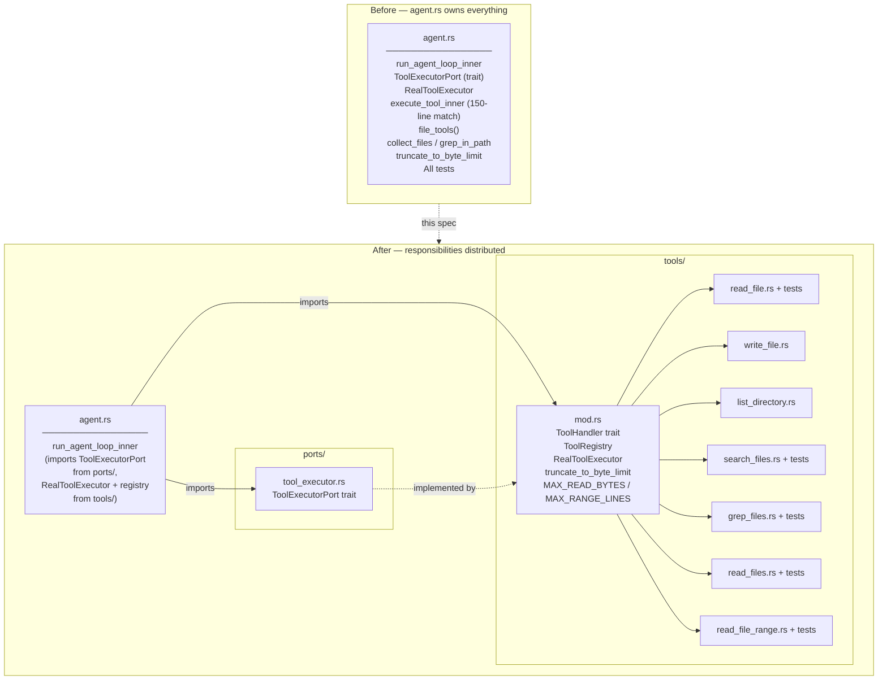

# Tool Executor Extraction

## Raw Requirement

> `execute_tool_inner` in `agent.rs` is a 150-line catch-all match with 7 tool handlers
> inline. `ToolExecutorPort` is defined in `agent.rs` rather than in a port or tools
> module. Each tool is not independently testable. The single-responsibility principle
> is violated: the agent loop file owns both orchestration logic and every tool
> implementation.

## Description

`agent.rs` currently does too much. It defines the agent loop, the tool executor port
interface, the real tool executor, and the implementations of all seven file tools in a
single `execute_tool_inner` match expression. Shared helper functions (`collect_files`,
`grep_in_path`, `truncate_to_byte_limit`) and their tests are also inline.

This specification extracts tool concerns into a dedicated `src/moeb/src/tools/` module:

- **`ToolExecutorPort`** moves to `src/moeb/src/ports/tool_executor.rs` — it is a port
  interface and belongs in the ports layer alongside `AiPort`.
- **`ToolHandler` trait** and **`ToolRegistry`** are introduced in `tools/mod.rs`. The
  registry owns a map of handlers and replaces `execute_tool_inner`.
- **Each of the seven tools** becomes a struct implementing `ToolHandler` in its own file
  under `tools/`, making it independently compilable and testable.
- **`RealToolExecutor`** moves to `tools/mod.rs`. It implements `ToolExecutorPort`,
  owns a `ToolRegistry`, handles timing, content-policy application, and trace recording,
  and delegates raw execution to the registry.
- **`agent.rs`** becomes a thin orchestrator: the agent loop, turn logging, and
  message-building remain; everything tool-related is imported from `tools/`.
- **Tests** migrate from `agent.rs` to the tool file they test.

The agent loop signature is unchanged. All callers of `run_agent_loop_traced` are
unaffected.

## Diagram



## Backlinks

### Parents

| Label | Path | Purpose |
|-------|------|---------|
| Moeb Hexagonal Architecture | [specifications/moeb/moeb.hex-architecture.md](specifications/moeb/moeb.hex-architecture.md) | Mandates the ports-and-adapters structure; `ToolExecutorPort` belongs in `ports/` as a secondary port interface |
| Adapter Factory Port | [specifications/moeb/moeb.adapter-factory-port.md](specifications/moeb/moeb.adapter-factory-port.md) | Established the pattern of moving port interfaces into `ports/` and concrete implementations into their own layer; this spec applies the same pattern to tool execution |
| Targeted File Reads: Line-Range Access Tool | [specifications/moeb/moeb.read-file-range.md](specifications/moeb/moeb.read-file-range.md) | Added `read_file_range` as the seventh tool and `MAX_RANGE_LINES`; both migrate into `tools/` |
| README | [README.md](../../README.md) | Root index |

### External

*(none)*

## Steps

### Step 1 — Create `ports/tool_executor.rs`

Create the file `src/moeb/src/ports/tool_executor.rs`:

```rust
use std::path::Path;
use anyhow::Result;

/// Secondary port — implemented by tool executors (real and replay).
/// The agent loop calls this port; concrete implementations live in `tools/`.
pub trait ToolExecutorPort: Send + Sync {
    fn execute(
        &self,
        name: &str,
        call_id: &str,
        args: &serde_json::Value,
        working_dir: &Path,
    ) -> Result<String>;
}
```

In `src/moeb/src/ports/mod.rs`, add:

```rust
pub mod tool_executor;
pub use tool_executor::ToolExecutorPort;
```

### Step 2 — Create `tools/mod.rs` with `ToolHandler`, `ToolRegistry`, and `RealToolExecutor`

Create `src/moeb/src/tools/mod.rs`. Declare the sub-modules and define the shared
constants, the trait, the registry, and the real executor.

**Sub-module declarations** (add one per tool file created in later steps):

```rust
pub mod grep_files;
pub mod list_directory;
pub mod read_file;
pub mod read_file_range;
pub mod read_files;
pub mod search_files;
pub mod write_file;
```

**Shared constants** (moved from `agent.rs`; keep them in `agent.rs` as `pub use` re-exports
so that any existing reference in tests compiles without change):

```rust
pub const MAX_READ_BYTES: usize = 102_400;
pub const MAX_RANGE_LINES: usize = 300;
```

**`truncate_to_byte_limit`** (moved verbatim from `agent.rs`; re-export from `agent.rs`):

```rust
pub fn truncate_to_byte_limit(content: String, limit: usize) -> String {
    if content.len() <= limit {
        return content;
    }
    let mut boundary = limit;
    while boundary > 0 && !content.is_char_boundary(boundary) {
        boundary -= 1;
    }
    let total = content.len();
    let shown = boundary;
    format!(
        "{}\n[... truncated: {} of {} chars shown ...]",
        &content[..boundary],
        shown,
        total
    )
}
```

**`ToolHandler` trait:**

```rust
use std::path::Path;
use anyhow::Result;
use crate::adapters::ToolDef;

pub trait ToolHandler: Send + Sync {
    fn name(&self) -> &'static str;
    fn definition(&self) -> ToolDef;
    fn execute(&self, args: &serde_json::Value, working_dir: &Path) -> Result<String>;
}
```

**`ToolRegistry`:**

```rust
use std::collections::HashMap;

pub struct ToolRegistry {
    handlers: HashMap<&'static str, Box<dyn ToolHandler>>,
}

impl ToolRegistry {
    pub fn new() -> Self {
        Self {
            handlers: HashMap::new(),
        }
    }

    /// Register the seven standard file tools.
    pub fn standard() -> Self {
        let mut r = Self::new();
        r.register(Box::new(read_file::ReadFileTool));
        r.register(Box::new(write_file::WriteFileTool));
        r.register(Box::new(list_directory::ListDirectoryTool));
        r.register(Box::new(search_files::SearchFilesTool));
        r.register(Box::new(grep_files::GrepFilesTool));
        r.register(Box::new(read_files::ReadFilesTool));
        r.register(Box::new(read_file_range::ReadFileRangeTool));
        r
    }

    pub fn register(&mut self, handler: Box<dyn ToolHandler>) {
        self.handlers.insert(handler.name(), handler);
    }

    pub fn execute(
        &self,
        name: &str,
        args: &serde_json::Value,
        working_dir: &Path,
    ) -> Result<String> {
        match self.handlers.get(name) {
            Some(h) => h.execute(args, working_dir),
            None => anyhow::bail!(
                "Unknown tool '{}'. Available: {}",
                name,
                self.handlers.keys().cloned().collect::<Vec<_>>().join(", ")
            ),
        }
    }

    pub fn definitions(&self) -> Vec<ToolDef> {
        // Return definitions in a stable order matching the original file_tools() order.
        let order = [
            "read_file", "write_file", "list_directory",
            "search_files", "grep_files", "read_files", "read_file_range",
        ];
        order.iter()
            .filter_map(|name| self.handlers.get(name).map(|h| h.definition()))
            .collect()
    }
}
```

**`RealToolExecutor`** (moved from `agent.rs`, now holds a `ToolRegistry`):

```rust
use std::sync::Arc;
use crate::ports::ToolExecutorPort;
use crate::trace::{
    apply_content_policy, FileContentMode, ToolCallEvent, TraceContext, TraceEvent,
};

pub struct RealToolExecutor {
    pub trace: Arc<TraceContext>,
    pub file_content_mode: FileContentMode,
    pub attempt: u32,
    pub current_turn: std::sync::atomic::AtomicU32,
    registry: ToolRegistry,
}

impl RealToolExecutor {
    pub fn new(trace: Arc<TraceContext>, file_content_mode: FileContentMode, attempt: u32) -> Self {
        Self {
            trace,
            file_content_mode,
            attempt,
            current_turn: std::sync::atomic::AtomicU32::new(1),
            registry: ToolRegistry::standard(),
        }
    }

    pub fn set_turn(&self, turn: u32) {
        self.current_turn.store(turn, std::sync::atomic::Ordering::SeqCst);
    }
}

impl ToolExecutorPort for RealToolExecutor {
    fn execute(
        &self,
        name: &str,
        call_id: &str,
        args: &serde_json::Value,
        working_dir: &Path,
    ) -> Result<String> {
        let start = std::time::Instant::now();
        let raw_result = self.registry.execute(name, args, working_dir);
        let duration_ms = start.elapsed().as_millis() as u64;

        let turn = self.current_turn.load(std::sync::atomic::Ordering::SeqCst);
        let (stored_result, content_hash, chars) =
            apply_content_policy(name, &raw_result, self.file_content_mode);

        let success = raw_result.is_ok();
        let return_val = match &raw_result {
            Ok(s) => s.clone(),
            Err(e) => format!("Error: {}", e),
        };

        self.trace.push(TraceEvent::ToolCall(ToolCallEvent {
            attempt: self.attempt,
            turn,
            call_id: call_id.to_string(),
            tool: name.to_string(),
            args: args.clone(),
            result: stored_result,
            content_hash,
            chars,
            success,
            duration_ms,
        }));

        Ok(return_val)
    }
}
```

### Step 3 — Create one file per tool under `tools/`

For each tool, create a file implementing `ToolHandler`. Each file follows the same
pattern: define a unit struct, implement the three trait methods, and include the tests
that previously lived in `agent.rs` for that tool.

**`tools/read_file.rs`** — implement `ReadFileTool`. The `execute` body is the
`"read_file"` arm of the old `execute_tool_inner`. Migrate tests:
`read_file_truncates_large_file` and `read_file_does_not_truncate_exact_limit`.

**`tools/write_file.rs`** — implement `WriteFileTool`. The `execute` body is the
`"write_file"` arm. No tests to migrate (none existed for this tool).

**`tools/list_directory.rs`** — implement `ListDirectoryTool`. The `execute` body is the
`"list_directory"` arm. No tests to migrate.

**`tools/search_files.rs`** — implement `SearchFilesTool`. Move `collect_files` as a
module-private function. Migrate tests: `search_files_returns_all_files_without_extension_filter`,
`search_files_filters_by_extension`, and `execute_tool_search_files_via_json`.

**`tools/grep_files.rs`** — implement `GrepFilesTool`. Move `grep_in_path` as a
module-private function. Migrate tests: `grep_files_finds_matching_lines`,
`grep_files_returns_empty_for_no_matches`, `grep_files_includes_file_and_line_number`,
and `execute_tool_grep_files_via_json`.

**`tools/read_files.rs`** — implement `ReadFilesTool`. Migrate tests:
`read_files_returns_all_contents`, `read_files_reports_error_inline_for_missing_path`,
and `read_files_truncates_each_file_independently`.

**`tools/read_file_range.rs`** — implement `ReadFileRangeTool`. Migrate tests:
`read_file_range_returns_correct_lines`, `read_file_range_clamps_to_max_range_lines`,
`read_file_range_clamps_to_file_end`, `read_file_range_rejects_end_before_start`,
`read_file_range_rejects_zero_start`, and `read_file_range_exact_cap_boundary`.

Each tool's `definition()` method returns the `ToolDef` that was previously constructed
inline in `file_tools()`. Copy the `name`, `description`, and `parameters` verbatim.

### Step 4 — Slim down `agent.rs`

In `src/moeb/src/agent.rs`:

1. **Remove** the `ToolExecutorPort` trait definition — it is now in `ports/`.
2. **Remove** `RealToolExecutor` struct and its `impl` blocks — they are now in `tools/`.
3. **Remove** `execute_tool_inner` — replaced by `ToolRegistry::execute`.
4. **Remove** `file_tools()` — replaced by `ToolRegistry::standard().definitions()`.
5. **Remove** `collect_files`, `grep_in_path`, `truncate_to_byte_limit`, and the private
   `truncate` helper — moved to `tools/`.
6. **Remove** all tests — migrated to tool files.

7. **Add** imports:
   ```rust
   use crate::ports::ToolExecutorPort;
   use crate::tools::{RealToolExecutor, ToolRegistry};
   ```

8. **Update** `run_agent_loop` (the untraced convenience function) to construct a
   `RealToolExecutor` via `crate::tools::RealToolExecutor::new(...)` instead of the
   local definition.

9. The `run_agent_loop_inner` signature is unchanged — it takes `&dyn ToolExecutorPort`,
   which is now resolved to the trait from `ports/`.

### Step 5 — Update call sites in domain and commands

In `src/moeb/src/domain/spec.rs` and `src/moeb/src/domain/run.rs`, update the import
of `RealToolExecutor`:

```rust
// Remove:
use crate::agent::RealToolExecutor;

// Add:
use crate::tools::RealToolExecutor;
```

The `file_tools()` call in both files becomes `ToolRegistry::standard().definitions()`:

```rust
// Remove:
let tools = crate::agent::file_tools();

// Add:
let tools = crate::tools::ToolRegistry::standard().definitions();
```

In `src/moeb/src/commands/replay.rs`, apply the same import update for any references
to `RealToolExecutor`, `ToolExecutorPort`, or `execute_tool_inner`.

### Step 6 — Register `tools` module in `main.rs`

In `src/moeb/src/main.rs`, add:

```rust
pub mod tools;
```

alongside the existing module declarations.

### Step 7 — Verify

Run `cargo build --release` and confirm zero compilation errors. Run `cargo test` and
confirm all migrated tests pass in their new locations. Confirm `agent.rs` contains no
references to `execute_tool_inner`, `collect_files`, `grep_in_path`, or
`truncate_to_byte_limit`. The following grep must return empty:

```
grep -n "execute_tool_inner\|collect_files\|grep_in_path\|truncate_to_byte_limit\|file_tools" \
  src/moeb/src/agent.rs
```

## Decisions

### Decision 1 — `ToolExecutorPort` moves to `ports/`, not to `tools/`

**Rationale:** `ToolExecutorPort` is a secondary port — an interface the agent loop
depends on, implemented by concrete executors. Port interfaces belong in `ports/` per the
hexagonal architecture mandate and the pattern established by `AiPort` and
`AdapterFactoryPort`. Keeping it in `tools/` would couple the port definition to its
implementations, violating separation of interface from implementation.

**Alternatives:**

| Option | Reason Rejected |
|--------|-----------------|
| Keep `ToolExecutorPort` in `agent.rs` | Couples the port definition to the agent orchestrator; the agent loop should depend on the port, not own it |
| Define it in `tools/mod.rs` | Tools are implementations; mixing the interface into the implementation module blurs the boundary |

**Consequences:** `agent.rs` imports `ToolExecutorPort` from `ports/`. `tools/mod.rs`
imports it from `ports/` to implement it on `RealToolExecutor`. The dependency direction
is: agent → ports ← tools, which is the correct hexagonal pattern.

---

### Decision 2 — `ToolHandler` trait includes both `definition()` and `execute()`

**Rationale:** A tool's JSON schema definition and its execution logic describe the same
operation and must stay in sync. If `definition()` and `execute()` live in separate
places, they can drift — the schema may claim a parameter exists that `execute()` does
not handle, or vice versa. Co-locating them in one struct per tool makes the coupling
explicit and verifiable by inspection.

**Alternatives:**

| Option | Reason Rejected |
|--------|-----------------|
| `definition()` remains a static constant in each file; only `execute()` in the trait | Co-location lost; definitions and handlers can diverge silently |
| Tool definitions kept in a separate `tool_defs.rs` file | Same problem; distance between definition and implementation invites drift |

**Consequences:** Adding a new parameter to a tool requires updating both the
`definition()` return value and the `execute()` implementation in the same struct. This
is enforced by proximity, not by the compiler.

---

### Decision 3 — `ToolRegistry::definitions()` returns tools in a fixed order matching `file_tools()`

**Rationale:** The AI adapter receives tool definitions in the order they are provided.
A change in tool order is a functional change — it can affect which tool the model
prefers when multiple tools are plausible. Preserving the original order from
`file_tools()` ensures behaviour is unchanged by this refactor.

**Alternatives:**

| Option | Reason Rejected |
|--------|-----------------|
| Return definitions in hash map insertion order | HashMap iteration order is not guaranteed stable across Rust versions |
| Return definitions in alphabetical order by name | Behaviour change; may affect model tool selection |
| Document order as unspecified | Introduces non-determinism into a refactor that should be behaviour-neutral |

**Consequences:** The order array in `definitions()` must be updated if a new tool is
added. The position of the new tool in the array is a decision that must be made
deliberately, not by default.

---

### Decision 4 — Tests migrate to the tool file they test; `agent.rs` test module is deleted

**Rationale:** Tests for `ReadFileTool` belong in `tools/read_file.rs`, not in
`agent.rs`. Co-locating tests with the code they test reduces the distance a developer
must travel to understand a failure, and ensures tests are deleted or updated when the
code they cover is deleted or updated.

**Alternatives:**

| Option | Reason Rejected |
|--------|-----------------|
| Keep all tests in `agent.rs` and add new tool tests there | Tests for tool logic drift further from tool implementations as the file grows |
| Move all tests to a `tests/` integration test directory | Integration tests are appropriate for multi-module scenarios; these are unit tests of single functions |

**Consequences:** The `#[cfg(test)] mod tests` block in `agent.rs` is deleted entirely.
Each tool file gains its own `#[cfg(test)] mod tests` block containing the tests
previously in `agent.rs`. Test names are unchanged to preserve `cargo test` output
familiarity.

---

### Decision 5 — `RealToolExecutor` owns a `ToolRegistry`; replay executor remains separate

**Rationale:** `RealToolExecutor` is the production executor and always needs the
standard registry. Embedding the registry directly avoids passing it as a parameter
everywhere `RealToolExecutor` is constructed. The replay executor (in `commands/replay.rs`)
uses a stub mechanism that intercepts tool calls from trace data — it does not use
`ToolRegistry` at all and is unaffected by this change.

**Alternatives:**

| Option | Reason Rejected |
|--------|-----------------|
| Pass `ToolRegistry` as a parameter to `RealToolExecutor::new` | Adds a parameter that all production call sites must supply identically; no flexibility benefit |
| Make `ToolRegistry` a global static | Prevents testing with a custom registry; Rust does not encourage mutable global state |

**Consequences:** `RealToolExecutor::new(trace, file_content_mode, attempt)` constructs
a `ToolRegistry::standard()` internally. Future tool additions require updating
`ToolRegistry::standard()`, which is the single registration point.

## Rubric

### Structured

| Name | Description | Threshold | Pass Condition |
|------|-------------|-----------|----------------|
| `binary-builds` | `cargo build --release` exits 0 | Zero errors | CI build exits 0 |
| `all-tests-pass` | `cargo test` exits 0 | Zero failures | `cargo test` exits 0 |
| `no-test-regression` | All tests that existed before this change pass after, in their new locations | Zero failures | `cargo test` exits 0; test names unchanged |
| `agent.rs` clean | `agent.rs` contains no tool implementation code | Zero matches | `grep -n "execute_tool_inner\|collect_files\|grep_in_path\|truncate_to_byte_limit\|file_tools" src/moeb/src/agent.rs` returns empty |
| `ToolExecutorPort` in ports | The trait is defined in `ports/tool_executor.rs` and exported from `ports/mod.rs` | Trait present | `grep -n "ToolExecutorPort" src/moeb/src/ports/mod.rs` shows a `pub use` line |
| Seven tools registered | `ToolRegistry::standard()` registers exactly seven handlers | Seven handlers | `ToolRegistry::standard().definitions().len() == 7` asserted in a unit test |
| Tool definition parity | Each tool's `definition()` output is byte-identical to the corresponding entry previously returned by `file_tools()` | Zero differences | Unit test compares `ToolRegistry::standard().definitions()` against the original `file_tools()` output field-by-field |

### Qualitative

- **Behaviour-neutral refactor:** A `moeb run` invocation before and after this change must produce the same sequence of tool calls, with identical tool definitions sent to the AI adapter. No tool name, description, or parameter schema may change.
- **Independent testability:** Each tool file must contain a `#[cfg(test)] mod tests` block with tests that can be run in isolation via `cargo test tools::read_file` (or the equivalent for each tool). A developer adding a new tool must be able to write and run its tests without running tests for all other tools.
- **Single extension point:** Adding an eighth tool must require changes in exactly two places: a new `tools/<name>.rs` file and one new `r.register(...)` line in `ToolRegistry::standard()`. No other file should require modification. This must be verifiable by the implementing agent before closing this specification.
