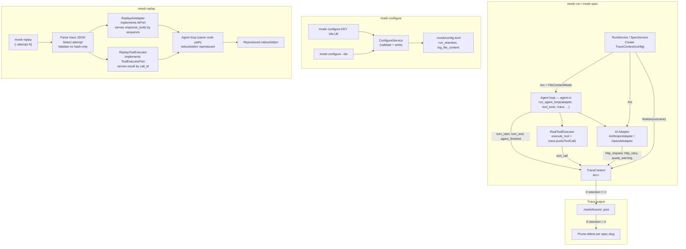

# Trace Capture, Replay, and Kernel Configuration

## Raw Requirement

> Trace & Replay — Revised Requirement Query
>
> Trace capture
> Always-on (unless RUN_RETENTION = 0). Both run and spec write a single trace file per invocation.
> Retries and multi-attempt spec loops are all contained within that one file — each event carries an
> attempt field (1-indexed) so the user can identify which attempt it belongs to.
>
> Location: .moeb/traces/<spec-slug>-<YYYYMMDDTHHMMSSz>.json
>
> Trace envelope:
> { "version": 1, "command": "run"|"spec", "spec": "moeb.kernel", "adapter": "anthropic",
>   "model": "claude-sonnet-4-6", "started_at": "<ISO-8601>", "ended_at": "<ISO-8601>",
>   "outcome": "success"|"failure", "error": "<message if failed>", "total_attempts": 2,
>   "events": [ ... ] }
>
> Event types — all events carry attempt:
>   turn_start    — attempt, turn, messages_sent: [Message]
>   http_request  — attempt, turn, http_attempt, url, request_body (Authorization stripped),
>                   response_status, response_headers, response_body, duration_ms
>   http_retry    — attempt, turn, http_attempt, delay_ms, reason
>   quota_warning — attempt, remaining
>   tool_call     — attempt, turn, call_id, tool, args, result (see file content policy),
>                   chars, success, duration_ms
>   turn_end      — attempt, turn, response_type: "tool_calls"|"text", response_content
>   agent_finished — attempt, turns, reason
>
> Security: Authorization headers stripped before writing. .moeb/traces/ is gitignored.
>
> File content in traces
> Configuration option: LOG_FILE_CONTENT (boolean, default true)
>   moeb configure LOG_FILE_CONTENT false
> When true: full file content embedded in tool_call events for read_file and read_files.
>   Replay is fully supported.
> When false: SHA-256 hash and char count stored instead of content. Replay is not supported.
>   moeb replay will detect this and fail with a clear message identifying unresplayable calls.
> Per-invocation overrides: --embed-files (force full content), --hash-files (force hash-only).
>
> Retention
> Configuration option: RUN_RETENTION (integer, default -1)
>   moeb configure RUN_RETENTION 10
>   -1  Retain all traces indefinitely (default)
>    0  Do not create or write any trace files
>   N>0 After each run, prune traces for that spec to the N most recent
> Pruning is per-spec-slug independently.
>
> moeb configure command
> New top-level command for setting persistent kernel configuration in .moeb/config.toml:
>   moeb configure <KEY> <VALUE>
> Keys: RUN_RETENTION (integer, default -1), LOG_FILE_CONTENT (bool, default true).
> Validates value type; rejects invalid input with a clear error.
> moeb configure --list prints all current config values.
>
> moeb replay command
>   moeb replay <trace-file>
> Re-runs the agent loop with:
>   AI stub    — serves saved response_body from each http_request event
>   Tool stub  — serves saved result from each tool_call event
> Must reproduce identical stdout/stderr to the original run.
> --attempt N targets a specific attempt (default: last successful, or last if all failed).
> Fails clearly if any tool_call event is hash-only, naming the offending tool calls.

## Description

This specification introduces always-on trace capture for `moeb run` and `moeb spec`, a `moeb configure`
command for managing kernel-level persistent configuration, and a `moeb replay` command for
deterministically replaying a captured trace without calling the real API or performing real file I/O.

**Trace capture.** On every invocation of `moeb run` or `moeb spec` (unless `RUN_RETENTION=0`), a single
JSON trace file is written to `.moeb/traces/`. The file captures every significant event in the agent
loop: turn boundaries, HTTP calls (with `Authorization` request headers stripped), HTTP retries, tool
invocations, and loop exit reason. For `moeb spec`, where the loop retries on validation failure, all
attempts share one file with incrementing `attempt` fields (1-indexed). The `total_attempts` field in
the envelope records the final count.

**File content policy.** When `LOG_FILE_CONTENT=true` (the default), full file contents returned by
`read_file` and `read_files` are embedded in `tool_call` events, enabling complete deterministic
replay. When `LOG_FILE_CONTENT=false`, a SHA-256 hex digest and character count are stored in place of
content; replay is impossible for any run that included file reads. Per-invocation flags `--embed-files`
and `--hash-files` override the configured value for a single run and take precedence over config. The
file content policy applies only to `read_file` and `read_files` results; all other tool results
(including `write_file` confirmations, `list_directory` output, etc.) are always stored in full.

**Retention.** `RUN_RETENTION` controls how many traces per spec-slug are kept. `-1` retains all
traces indefinitely. `0` disables trace creation for every run. `N > 0` triggers pruning after each
run: all existing traces for that spec-slug are listed, sorted lexicographically by filename (ISO-like
timestamps sort correctly), and the oldest beyond `N` are deleted. Pruning is per-spec-slug — traces
for `moeb.kernel` and `moeb.anthropic-adapter` are counted and pruned independently.

**`moeb configure` command.** A new top-level command writes kernel-wide configuration values to
`.moeb/config.toml` (alongside the existing `active_adapter` and `[adapters.*]` tables). The command
validates the value type before writing and rejects invalid input with a clear error message. A `--list`
flag prints all current kernel configuration keys, their effective values, and their defaults.
This command is distinct from `moeb adapter <name> config`, which manages per-adapter settings.

**`moeb replay` command.** Reads a trace file and re-runs the agent loop using an AI stub (implements
`AiPort` by replaying saved HTTP response bodies in sequence) and a tool stub (implements
`ToolExecutorPort` by returning saved tool call results keyed by call_id). The replay loop is
identical in structure to the real loop, so stdout/stderr output is reproduced faithfully. The
`--attempt N` flag selects which attempt to replay; omitting it defaults to the last successful
attempt, or the last attempt if all failed. Before starting, replay validates that no `tool_call`
event in the targeted attempt has hash-only content; if any are found, it fails immediately with an
error listing the offending call_id, tool name, and arguments.

**`ToolExecutorPort` extraction.** To support both real execution and replay stubs, `execute_tool` in
`agent.rs` is refactored into a `ToolExecutorPort` trait with a single `execute` method. The existing
logic becomes `RealToolExecutor`. The agent loop accepts `Box<dyn ToolExecutorPort>` in place of
direct function calls, and `RealToolExecutor` emits `tool_call` trace events. `ReplayToolExecutor`
serves saved results and emits no events.

## Diagram



## Backlinks

### Parents

| Label | Path | Purpose |
|-------|------|---------|
| Moeb Kernel | [specifications/moeb/moeb.kernel.md](specifications/moeb/moeb.kernel.md) | Establishes the agent loop, tool surface, `AiPort` trait, and `.moeb/` directory layout |
| Moeb Hexagonal Architecture | [specifications/moeb/moeb.hex-architecture.md](specifications/moeb/moeb.hex-architecture.md) | Mandates ports-and-adapters structure; `TraceContext` must not leak into domain logic; new traits follow the same pattern |
| Adapter Configuration, Release, and Listing | [specifications/moeb/moeb.adapter-config-and-listing.md](specifications/moeb/moeb.adapter-config-and-listing.md) | Establishes `MoebConfig`, `[adapters.<name>]` config pattern, and `moeb adapter config` command; `moeb configure` targets kernel-level keys and must not conflict |
| Kernel Adapter Rate Limiting with Exponential Backoff | [specifications/moeb/moeb.kernel-rate-limiting.md](specifications/moeb/moeb.kernel-rate-limiting.md) | Established the quota-warning stderr output and the HTTP retry logic whose events must be captured in trace |
| Spec Validation Retry with User-Visible Error Reporting | [specifications/moeb/moeb.spec-retry-on-validation-failure.md](specifications/moeb/moeb.spec-retry-on-validation-failure.md) | Established the spec retry loop; each retry must produce trace events with an incrementing `attempt` field |
| Agent File-Read Optimization | [specifications/moeb/moeb.agent-read-optimization.md](specifications/moeb/moeb.agent-read-optimization.md) | Added `read_files` batch tool; both `read_file` and `read_files` results are subject to the file content policy |
| Git Initialisation and Initial Commit | [specifications/vcs/vcs.git-init.md](specifications/vcs/vcs.git-init.md) | Established the `.gitignore` at the project root; this spec appends `.moeb/traces/` to it |

### External

*(none)*

## Steps

### Step 1 — Add `chrono`, `sha2`, and `hex` dependencies to `src/moeb/Cargo.toml`

In `src/moeb/Cargo.toml`, add to the `[dependencies]` section:

```toml
chrono = { version = "0.4", features = ["serde"] }
sha2 = "0.10"
hex = "0.4"
```

These are required for UTC timestamps in the trace envelope, SHA-256 hashing of file content, and
hex encoding of content hashes.

### Step 2 — Create `src/moeb/src/trace.rs` with all data types and `TraceContext`

Create `src/moeb/src/trace.rs`. Declare it in `lib.rs` or `main.rs` as appropriate with
`pub mod trace;`.

**Enums and event structs** — all must derive `Debug, Clone, Serialize, Deserialize`:

```rust
#[derive(Debug, Clone, Serialize, Deserialize)]
#[serde(rename_all = "snake_case")]
pub enum TraceCommand { Run, Spec }

#[derive(Debug, Clone, Serialize, Deserialize)]
#[serde(rename_all = "snake_case")]
pub enum TraceOutcome { Success, Failure }

#[derive(Debug, Clone, Serialize, Deserialize)]
#[serde(rename_all = "snake_case")]
pub enum TurnResponseType { ToolCalls, Text }

#[derive(Debug, Clone, Serialize, Deserialize)]
#[serde(rename_all = "snake_case")]
pub enum AgentFinishReason {
    Completion,
    MaxTurns,
    ConsecutiveTextTurns,
    Error,
}

#[derive(Debug, Clone, Copy, PartialEq)]
pub enum FileContentMode { Embed, Hash }
```

**Event structs:**

```rust
#[derive(Debug, Clone, Serialize, Deserialize)]
pub struct TurnStartEvent {
    pub attempt: u32,
    pub turn: u32,
    pub messages_sent: Vec<serde_json::Value>,
}

#[derive(Debug, Clone, Serialize, Deserialize)]
pub struct HttpRequestEvent {
    pub attempt: u32,
    pub turn: u32,
    pub http_attempt: u32,
    pub url: String,
    pub request_body: serde_json::Value,   // Authorization key stripped
    pub response_status: u16,
    pub response_headers: serde_json::Value, // auth headers stripped
    pub response_body: serde_json::Value,
    pub duration_ms: u64,
}

#[derive(Debug, Clone, Serialize, Deserialize)]
pub struct HttpRetryEvent {
    pub attempt: u32,
    pub turn: u32,
    pub http_attempt: u32,
    pub delay_ms: u64,
    pub reason: String,
}

#[derive(Debug, Clone, Serialize, Deserialize)]
pub struct QuotaWarningEvent {
    pub attempt: u32,
    pub remaining: String,
}

#[derive(Debug, Clone, Serialize, Deserialize)]
pub struct ToolCallEvent {
    pub attempt: u32,
    pub turn: u32,
    pub call_id: String,
    pub tool: String,
    pub args: serde_json::Value,
    /// Full tool result. None when file content policy is Hash and tool is read_file/read_files.
    pub result: Option<String>,
    /// SHA-256 hex digest of the result. Present only when result is None.
    pub content_hash: Option<String>,
    pub chars: u64,
    pub success: bool,
    pub duration_ms: u64,
}

#[derive(Debug, Clone, Serialize, Deserialize)]
pub struct TurnEndEvent {
    pub attempt: u32,
    pub turn: u32,
    pub response_type: TurnResponseType,
    pub response_content: serde_json::Value,
}

#[derive(Debug, Clone, Serialize, Deserialize)]
pub struct AgentFinishedEvent {
    pub attempt: u32,
    pub turns: u32,
    pub reason: AgentFinishReason,
}
```

**`TraceEvent` tagged union:**

```rust
#[derive(Debug, Clone, Serialize, Deserialize)]
#[serde(tag = "type", rename_all = "snake_case")]
pub enum TraceEvent {
    TurnStart(TurnStartEvent),
    HttpRequest(HttpRequestEvent),
    HttpRetry(HttpRetryEvent),
    QuotaWarning(QuotaWarningEvent),
    ToolCall(ToolCallEvent),
    TurnEnd(TurnEndEvent),
    AgentFinished(AgentFinishedEvent),
}
```

**`TraceEnvelope`:**

```rust
#[derive(Debug, Clone, Serialize, Deserialize)]
pub struct TraceEnvelope {
    pub version: u32,
    pub command: TraceCommand,
    pub spec: String,
    pub adapter: String,
    pub model: String,
    pub started_at: String,
    pub ended_at: String,
    pub outcome: TraceOutcome,
    #[serde(skip_serializing_if = "Option::is_none")]
    pub error: Option<String>,
    pub total_attempts: u32,
    pub events: Vec<TraceEvent>,
}
```

**`TraceConfig`** (immutable session config):

```rust
pub struct TraceConfig {
    pub command: TraceCommand,
    pub spec: String,       // e.g. "moeb.kernel"
    pub adapter: String,
    pub model: String,
    pub retention: i32,
    pub file_content_mode: FileContentMode,
}
```

**`TraceContext`** (shared mutable event collector):

```rust
pub struct TraceContext {
    config: TraceConfig,
    started_at: chrono::DateTime<chrono::Utc>,
    events: std::sync::Mutex<Vec<TraceEvent>>,
    total_attempts: std::sync::Mutex<u32>,
}

impl TraceContext {
    pub fn new(config: TraceConfig) -> Self {
        Self {
            config,
            started_at: chrono::Utc::now(),
            events: std::sync::Mutex::new(Vec::new()),
            total_attempts: std::sync::Mutex::new(1),
        }
    }

    pub fn push(&self, event: TraceEvent) {
        self.events.lock().unwrap().push(event);
    }

    pub fn set_total_attempts(&self, n: u32) {
        *self.total_attempts.lock().unwrap() = n;
    }

    pub fn finalize(&self, outcome: TraceOutcome, error: Option<String>) -> anyhow::Result<()> {
        if self.config.retention == 0 {
            return Ok(());
        }
        let ended_at = chrono::Utc::now();
        let events = self.events.lock().unwrap().clone();
        let total_attempts = *self.total_attempts.lock().unwrap();
        let envelope = TraceEnvelope {
            version: 1,
            command: self.config.command.clone(),
            spec: self.config.spec.clone(),
            adapter: self.config.adapter.clone(),
            model: self.config.model.clone(),
            started_at: self.started_at.to_rfc3339(),
            ended_at: ended_at.to_rfc3339(),
            outcome,
            error,
            total_attempts,
            events,
        };
        let json = serde_json::to_string_pretty(&envelope)?;
        // Filename: <spec>-<YYYYMMDDTHHMMSSz>.json
        let ts = self.started_at.format("%Y%m%dT%H%M%S").to_string() + "z";
        let filename = format!("{}-{}.json", self.config.spec, ts);
        let dir = std::path::Path::new(".moeb/traces");
        std::fs::create_dir_all(dir)?;
        std::fs::write(dir.join(&filename), json)?;
        if self.config.retention > 0 {
            prune_traces(&self.config.spec, self.config.retention as usize);
        }
        Ok(())
    }
}
```

`prune_traces(spec: &str, keep: usize)`: List all files in `.moeb/traces/` whose names start with
`<spec>-` and end with `.json`. Sort lexicographically by filename. If the count exceeds `keep`,
delete the files at the front (lowest filenames, i.e. oldest) until only `keep` remain. Silently
ignore per-file deletion errors.

### Step 3 — Extend `MoebConfig` in `src/moeb/src/config.rs`

Add two fields to `MoebConfig`:

```rust
pub run_retention: Option<i32>,
pub log_file_content: Option<bool>,
```

Both fields must use `#[serde(skip_serializing_if = "Option::is_none")]` so that absent values do
not appear in `config.toml`.

Add helper methods:

```rust
impl MoebConfig {
    pub fn effective_run_retention(&self) -> i32 {
        self.run_retention.unwrap_or(-1)
    }
    pub fn effective_log_file_content(&self) -> bool {
        self.log_file_content.unwrap_or(true)
    }
}
```

Add unit tests in `config.rs`:
- `run_retention_defaults_to_minus_one`: construct `MoebConfig::default()` and assert
  `effective_run_retention() == -1`.
- `log_file_content_defaults_to_true`: assert `effective_log_file_content() == true`.
- `kernel_config_round_trips`: write `run_retention = Some(5)` and `log_file_content = Some(false)`,
  save, reload, assert values preserved and no extra keys written.

### Step 4 — Implement `moeb configure` in `src/moeb/src/commands/configure.rs`

Create `src/moeb/src/commands/configure.rs`. The public interface:

```rust
pub fn run_configure(key: &str, value: &str) -> anyhow::Result<()>
pub fn run_list() -> anyhow::Result<()>
```

**`run_configure`:**

1. Match `key` case-insensitively:
   - `"RUN_RETENTION"`: parse `value` as `i32`. If parsing fails, bail with:
     `"RUN_RETENTION requires an integer value (e.g. -1, 0, 10). Got: \"<value>\""`.
     If the parsed value is less than `-1`, bail with:
     `"RUN_RETENTION must be -1 (unlimited), 0 (disabled), or a positive integer."`.
     Write `config.run_retention = Some(parsed)`.
   - `"LOG_FILE_CONTENT"`: parse `value` case-insensitively as a boolean accepting `"true"` and
     `"false"`. If parsing fails, bail with:
     `"LOG_FILE_CONTENT requires true or false. Got: \"<value>\""`.
     Write `config.log_file_content = Some(parsed)`.
   - Any other key: bail with:
     `"Unknown configuration key \"<key>\". Valid keys: RUN_RETENTION, LOG_FILE_CONTENT"`.

2. Load `MoebConfig`, apply the change, call `MoebConfig::save()`.
3. Print: `"<KEY> set to <value>."` to stdout.

**`run_list`:**

Print the following table to stdout (columns aligned with spaces):

```
KEY                  VALUE    DEFAULT    DESCRIPTION
RUN_RETENTION        -1       -1         Trace retention per spec (-1=unlimited, 0=disabled, N=keep N)
LOG_FILE_CONTENT     true     true       Embed file content in traces (false=hash-only, disables replay)
```

The VALUE column shows the effective value (from config if set, otherwise the default). The DEFAULT
column always shows the compiled-in default.

### Step 5 — Wire `moeb configure` into `main.rs`

In `src/moeb/src/main.rs`, extend the `Commands` enum:

```rust
/// Set or list persistent kernel configuration values
Configure {
    /// Configuration key (RUN_RETENTION, LOG_FILE_CONTENT)
    key: Option<String>,
    /// Value to assign
    value: Option<String>,
    /// List all configuration keys and their current values
    #[arg(long)]
    list: bool,
},
```

In the match block:

```rust
Commands::Configure { key, value, list } => {
    if list {
        commands::configure::run_list()?;
    } else {
        let k = key.context("Key is required. Usage: moeb configure <KEY> <VALUE>")?;
        let v = value.context("Value is required. Usage: moeb configure <KEY> <VALUE>")?;
        commands::configure::run_configure(&k, &v)?;
    }
}
```

### Step 6 — Add `--embed-files` and `--hash-files` flags to `moeb run` and `moeb spec`

In `main.rs`, extend the `Run` and `Spec` command variants:

```rust
Run {
    spec: String,
    /// Force full file content in trace (overrides LOG_FILE_CONTENT)
    #[arg(long)]
    embed_files: bool,
    /// Force hash-only file content in trace (overrides LOG_FILE_CONTENT)
    #[arg(long)]
    hash_files: bool,
},
```

Add the same two flags to `Spec`. When both `--embed-files` and `--hash-files` are supplied
simultaneously, bail with: `"--embed-files and --hash-files are mutually exclusive."`.

Derive `FileContentMode` in the command dispatch:

```rust
let file_content_mode = if embed_files {
    FileContentMode::Embed
} else if hash_files {
    FileContentMode::Hash
} else if MoebConfig::load().unwrap_or_default().effective_log_file_content() {
    FileContentMode::Embed
} else {
    FileContentMode::Hash
};
```

Pass `file_content_mode` to the service layer.

### Step 7 — Extract `ToolExecutorPort` trait from `agent.rs`

In `src/moeb/src/ports/tool_executor.rs` (or directly in `agent.rs` if the hexagonal architecture
keeps it co-located), define:

```rust
pub trait ToolExecutorPort: Send + Sync {
    fn execute(
        &self,
        name: &str,
        call_id: &str,
        args: &serde_json::Value,
        working_dir: &std::path::Path,
    ) -> anyhow::Result<String>;
}
```

Move the existing `execute_tool` function body into a `RealToolExecutor` struct:

```rust
pub struct RealToolExecutor {
    pub trace: std::sync::Arc<TraceContext>,
    pub file_content_mode: FileContentMode,
    pub attempt: u32,
}

impl ToolExecutorPort for RealToolExecutor {
    fn execute(&self, name: &str, call_id: &str, args: &serde_json::Value,
               working_dir: &std::path::Path) -> anyhow::Result<String> {
        let start = std::time::Instant::now();
        let result = execute_tool_inner(name, args, working_dir);
        let duration_ms = start.elapsed().as_millis() as u64;
        // Apply file content policy and emit ToolCall event — see Step 10.
        result
    }
}
```

Update `run_agent_loop` to accept `tool_exec: &dyn ToolExecutorPort` in place of calling
`execute_tool` directly.

Export `ToolExecutorPort` from `src/moeb/src/ports/mod.rs`.

### Step 8 — Update `run_agent_loop` signature and thread `TraceContext` through

Update the signature of `run_agent_loop` (or equivalent in `agent.rs`) to:

```rust
pub fn run_agent_loop(
    adapter: &dyn AiPort,
    tool_exec: &dyn ToolExecutorPort,
    tools: &[ToolDef],
    working_dir: &std::path::Path,
    initial_messages: Vec<Message>,
    max_turns: u32,
    trace: &TraceContext,
    attempt: u32,
) -> anyhow::Result<()>
```

The `attempt` parameter is the 1-indexed attempt number passed in by the caller (`RunService` always
passes `1`; `SpecService` passes the current retry count).

Update all call sites in `run.rs` and `spec.rs` accordingly.

### Step 9 — Emit turn events in the agent loop

At the start of each loop iteration (before sending messages to the adapter), push a `TurnStart`
event:

```rust
trace.push(TraceEvent::TurnStart(TurnStartEvent {
    attempt,
    turn: turn_number,
    messages_sent: messages.iter()
        .map(|m| serde_json::to_value(m).unwrap_or(serde_json::Value::Null))
        .collect(),
}));
```

After processing the adapter response and collecting all tool results, push a `TurnEnd` event:

```rust
trace.push(TraceEvent::TurnEnd(TurnEndEvent {
    attempt,
    turn: turn_number,
    response_type: match &response {
        AgentResponse::ToolCalls(_) => TurnResponseType::ToolCalls,
        AgentResponse::Text(_) => TurnResponseType::Text,
    },
    response_content: match &response {
        AgentResponse::ToolCalls(calls) => serde_json::to_value(calls)
            .unwrap_or(serde_json::Value::Null),
        AgentResponse::Text(t) => serde_json::Value::String(t.clone()),
    },
}));
```

When the loop exits (for any reason), push an `AgentFinished` event:

```rust
trace.push(TraceEvent::AgentFinished(AgentFinishedEvent {
    attempt,
    turns: turn_number,
    reason: finish_reason, // Completion | MaxTurns | ConsecutiveTextTurns | Error
}));
```

### Step 10 — Emit HTTP events in adapters

In both `AnthropicAdapter` and `OpenAiAdapter`, add a field:

```rust
trace: std::sync::Arc<TraceContext>,
attempt: std::sync::Arc<std::sync::atomic::AtomicU32>,
```

Update the constructor (`from_secrets_and_config`) to accept
`trace: std::sync::Arc<TraceContext>, attempt: std::sync::Arc<std::sync::atomic::AtomicU32>`.

In the HTTP send method, before each request:

1. Record `start = Instant::now()`.
2. After receiving a response (or error), assemble an `HttpRequestEvent`:
   - Strip the `Authorization` key from `request_body` (and from request headers map if serialised
     separately) before storing. Stripping is case-insensitive on the key name.
   - Strip any response header whose name equals `authorization` (case-insensitive).
   - Store `response_status`, `response_headers` (as a JSON object), `response_body` (parsed JSON
     or raw string wrapped as JSON), `duration_ms`.
3. Push `TraceEvent::HttpRequest(...)`.

On each retry decision (before sleeping), push `TraceEvent::HttpRetry(HttpRetryEvent { attempt,
turn, http_attempt, delay_ms, reason })` where `reason` is a human-readable string such as
`"HTTP 429 Too Many Requests"` or `"transport error: connection reset"`.

When the existing quota-warning stderr message is emitted (as established in
`moeb.kernel-rate-limiting.md`), also push:

```rust
trace.push(TraceEvent::QuotaWarning(QuotaWarningEvent {
    attempt: self.attempt.load(std::sync::atomic::Ordering::SeqCst),
    remaining: remaining_value.to_string(),
}));
```

The `turn` field needed for `HttpRequest` and `HttpRetry` is provided by the caller; pass it as a
parameter to the adapter's send method, or thread it through a context object. Choose whichever
approach requires the fewest trait signature changes while remaining consistent with the hexagonal
architecture.

### Step 11 — Emit `tool_call` events from `RealToolExecutor` with file content policy

In `RealToolExecutor::execute`, after `execute_tool_inner` returns:

```rust
let (stored_result, content_hash, chars) =
    apply_content_policy(name, &raw_result, self.file_content_mode);

trace.push(TraceEvent::ToolCall(ToolCallEvent {
    attempt: self.attempt,
    turn: self.current_turn,  // passed in from the agent loop
    call_id: call_id.to_string(),
    tool: name.to_string(),
    args: args.clone(),
    result: stored_result,
    content_hash,
    chars,
    success: raw_result.is_ok(),
    duration_ms,
}));
```

`apply_content_policy(tool: &str, result: &Result<String>, mode: FileContentMode)
-> (Option<String>, Option<String>, u64)`:

- If the tool is not `"read_file"` or `"read_files"`, always return
  `(Some(result_text.clone()), None, result_text.len() as u64)`.
- If mode is `Embed`, return `(Some(result_text.clone()), None, result_text.len() as u64)`.
- If mode is `Hash`:
  - Compute SHA-256 of the result text bytes using `sha2::Sha256`.
  - Return `(None, Some(hex::encode(digest)), result_text.len() as u64)`.

When `raw_result` is `Err`, record `success: false`, `result: Some(error_string)`,
`content_hash: None`, `chars: 0`.

### Step 12 — Create `TraceContext` in `RunService` and `SpecService`

In `src/moeb/src/domain/run.rs`, at the start of `RunService::run`:

```rust
let cfg = MoebConfig::load().unwrap_or_default();
let trace_config = TraceConfig {
    command: TraceCommand::Run,
    spec: spec_name.to_string(),
    adapter: cfg.active_adapter.clone().unwrap_or_default(),
    model: cfg.adapter_config(&cfg.active_adapter.clone().unwrap_or_default())
               .effective_model(DEFAULT_MODEL),
    retention: cfg.effective_run_retention(),
    file_content_mode, // from caller
};
let trace = std::sync::Arc::new(TraceContext::new(trace_config));
```

Construct the adapter with `Arc::clone(&trace)`. Pass `Arc::clone(&trace)` to
`run_agent_loop`. After the loop returns (success or error), call:

```rust
trace.finalize(
    if result.is_ok() { TraceOutcome::Success } else { TraceOutcome::Failure },
    result.as_ref().err().map(|e| e.to_string()),
)?;
```

Apply the same pattern in `SpecService::spec`. For `moeb spec`, which retries on validation failure,
call `trace.set_total_attempts(attempt_count)` after the retry loop concludes, before `finalize`.

### Step 13 — Add `.moeb/traces/` to `.gitignore`

Open the `.gitignore` file at the repository root (created by the vcs spec). Append the following
line if not already present:

```
.moeb/traces/
```

### Step 14 — Implement `ReplayAiAdapter` and `ReplayToolExecutor`

Create `src/moeb/src/replay.rs`.

**`ReplayAiAdapter`** — implements `AiPort`. Holds a `VecDeque<serde_json::Value>` of saved
`response_body` values extracted from `HttpRequestEvent`s for the target attempt, in order. Each
call to `send` pops the front response body and parses it exactly as the real adapter would, so
that `AgentResponse` is reconstructed identically. If the queue is empty, return an error.

**`ReplayToolExecutor`** — implements `ToolExecutorPort`. Holds a
`HashMap<String, String>` keyed by `call_id`, mapping to the saved `result` string from
`ToolCallEvent`s for the target attempt. In `execute`, look up `call_id` and return the saved
result. If the call_id is not found, return an error naming the missing id.

Neither stub emits trace events.

### Step 15 — Implement `moeb replay` in `src/moeb/src/commands/replay.rs`

```rust
pub fn run_replay(trace_path: &str, attempt_override: Option<u32>) -> anyhow::Result<()>
```

1. Read and parse the trace file as `TraceEnvelope`.
2. Determine the target attempt number:
   - If `--attempt N` supplied, use N.
   - Otherwise, find the last attempt for which an `AgentFinished` event with `reason = Completion`
     exists. If none, use the highest attempt number present.
3. **Validate replayability**: collect all `ToolCall` events for the target attempt where `result`
   is `None` (hash-only). If any exist, bail with:
   ```
   Error: trace is not fully replayable. The following tool calls have hash-only content:
     attempt <a>, turn <t>, call_id "<id>", tool "<tool>", args <args>
   To capture full content, re-run with: moeb run --embed-files <spec>
   Or set: moeb configure LOG_FILE_CONTENT true
   ```
4. Extract `HttpRequestEvent`s for the target attempt in order → build `ReplayAiAdapter`.
5. Extract `ToolCallEvent`s for the target attempt keyed by `call_id` → build `ReplayToolExecutor`.
6. Reconstruct `initial_messages` from the `TurnStart` event for `turn = 1` of the target attempt
   (`messages_sent` field).
7. Call `run_agent_loop` with `ReplayAiAdapter`, `ReplayToolExecutor`, the reconstructed messages,
   and a `NoopTraceContext` (a `TraceContext` constructed with `retention = 0` so no file is
   written during replay).
8. The replay loop will print to stdout/stderr identically to the original run.

### Step 16 — Wire `moeb replay` into `main.rs`

Extend `Commands`:

```rust
/// Replay a captured trace without calling the real API
Replay {
    /// Path to the trace JSON file
    trace_file: String,
    /// Attempt number to replay (default: last successful, or last if all failed)
    #[arg(long)]
    attempt: Option<u32>,
},
```

In the match block:

```rust
Commands::Replay { trace_file, attempt } => {
    commands::replay::run_replay(&trace_file, attempt)?;
}
```

### Step 17 — Add unit tests

**In `src/moeb/src/trace.rs` `#[cfg(test)]` module:**

- `trace_context_noop_when_retention_zero`: construct a `TraceContext` with `retention = 0`; push
  several events; call `finalize(TraceOutcome::Success, None)`; assert no file is written to
  `.moeb/traces/`.

- `trace_context_writes_file_when_retention_minus_one`: in a temp dir, construct a `TraceContext`
  with `retention = -1`; push one `TurnStart` event; call `finalize`; assert a `.json` file exists
  in `.moeb/traces/` and its content parses as valid JSON with `"version": 1`.

- `prune_keeps_n_most_recent`: seed `.moeb/traces/` with 5 files named `moeb.test-<ts>.json` with
  distinct lexicographic timestamps; call `prune_traces("moeb.test", 3)`; assert only 3 files
  remain and they are the three with the highest (most recent) timestamps.

- `apply_content_policy_embeds_by_default`: call `apply_content_policy("read_file", &Ok("hello".into()),
  FileContentMode::Embed)`; assert `result = Some("hello")`, `content_hash = None`, `chars = 5`.

- `apply_content_policy_hashes_when_mode_hash`: call with `FileContentMode::Hash`; assert
  `result = None`, `content_hash = Some(<valid hex string>)`, `chars = 5`.

- `apply_content_policy_always_embeds_non_read_tools`: call with tool `"write_file"` and
  `FileContentMode::Hash`; assert `result = Some(...)` (policy does not apply to non-read tools).

**In `src/moeb/src/commands/configure.rs` `#[cfg(test)]` module:**

- `configure_run_retention_sets_value`: call `run_configure("RUN_RETENTION", "10")` in a temp dir;
  reload `MoebConfig`; assert `run_retention = Some(10)`.

- `configure_log_file_content_false`: call `run_configure("LOG_FILE_CONTENT", "false")`; assert
  `log_file_content = Some(false)`.

- `configure_rejects_invalid_retention`: call `run_configure("RUN_RETENTION", "abc")`; assert error
  message contains `"integer"`.

- `configure_rejects_retention_below_minus_one`: call `run_configure("RUN_RETENTION", "-5")`; assert
  error message contains `"-1"`.

- `configure_rejects_unknown_key`: call `run_configure("TIMEOUT", "30")`; assert error message
  contains `"Unknown configuration key"` and lists valid keys.

**In `src/moeb/src/replay.rs` `#[cfg(test)]` module:**

- `replay_fails_on_hash_only_tool_call`: construct a `TraceEnvelope` containing one `ToolCall`
  event with `result = None` and `content_hash = Some("abc")` for attempt 1; call
  `run_replay_from_envelope(&envelope, None)`; assert the function returns `Err` and the error
  message contains `"not fully replayable"` and the `call_id`.

## Decisions

### Decision 1 — Single trace file per invocation with per-event `attempt` field

**Rationale:** A single file gives a complete picture of the invocation history without requiring
the user to correlate multiple files. The `attempt` field on every event makes it trivial to filter
to a specific retry without splitting files. The alternative of one file per attempt would produce a
fragmented view and require a new naming scheme to associate attempts with the same invocation.

**Alternatives:**

| Option | Reason Rejected |
|--------|-----------------|
| One file per attempt | Correlating attempts from the same invocation requires extra tooling; no single file captures the full session |
| Append to a per-spec log (no timestamps in filename) | Multiple invocations would be in one file; identifying and replaying a specific invocation becomes ambiguous |

**Consequences:** The `total_attempts` field in the envelope and the `attempt` field on all events
are required for the file to be interpretable. Both fields are mandatory and must always be present.

---

### Decision 2 — `TraceContext` uses `Arc<Mutex<>>` without changing `AiPort` or domain trait signatures

**Rationale:** The adapter constructors already accept configuration via their constructor
(`from_secrets_and_config`). Passing `Arc<TraceContext>` at construction time keeps the `AiPort`
trait unchanged — a trait-signature change would require updating every adapter and every call site.
The `Arc` allows the agent loop, adapter, and tool executor to hold independent references to the
same context without lifetime constraints.

**Alternatives:**

| Option | Reason Rejected |
|--------|-----------------|
| Add `trace: &TraceContext` parameter to `AiPort::send` | Breaks the `AiPort` trait contract; every adapter must be updated; trait objects become harder to construct |
| Thread-local `TraceContext` | Invisible coupling; makes testing difficult; breaks with multi-threaded adapters |
| Channel-based event sink | Introduces async complexity; overkill for a single-threaded CLI tool |

**Consequences:** Adapters receive an `Arc<TraceContext>` at construction. This is a one-time
addition to each adapter's constructor. Future adapters must also accept this parameter.

---

### Decision 3 — Extract `ToolExecutorPort` trait to enable replay stubs

**Rationale:** The `moeb replay` command must intercept tool calls and serve saved results rather
than performing real file I/O. Without a trait, the replay command would need to duplicate the
entire agent loop or use runtime patching. Extracting `ToolExecutorPort` follows the hexagonal
architecture already established in the codebase and makes both real and replay execution paths
use the same `run_agent_loop` code.

**Alternatives:**

| Option | Reason Rejected |
|--------|-----------------|
| Separate replay loop duplicating agent.rs logic | Duplicated code diverges over time; any bug fix in the real loop must be mirrored manually |
| Conditionally branch inside `execute_tool` on a `replay_mode` flag | Hidden control flow; flags are a maintenance liability; violates the hexagonal architecture principle |

**Consequences:** `run_agent_loop` gains a `tool_exec: &dyn ToolExecutorPort` parameter. This is
a breaking change to the function signature, but it is internal to `agent.rs` and affects only
the two call sites in `run.rs` and `spec.rs`.

---

### Decision 4 — SHA-256 for file content hashing

**Rationale:** SHA-256 is a well-established, collision-resistant hash function available in the
Rust ecosystem via the `sha2` crate. It provides strong integrity guarantees. MD5 and CRC32 were
rejected for being cryptographically weak.

**Alternatives:**

| Option | Reason Rejected |
|--------|-----------------|
| MD5 | Cryptographically broken; poor choice even for non-security uses when a standard alternative exists |
| CRC32 | High collision probability on large files; not a cryptographic hash |
| BLAKE3 | Newer and faster, but adds another dependency with less ecosystem precedent than `sha2` |

**Consequences:** Content hashes in traces are 64-character lowercase hex strings. The `sha2` and
`hex` crates are added as dependencies.

---

### Decision 5 — `moeb configure` is a top-level command distinct from `moeb adapter <name> config`

**Rationale:** `moeb configure` sets kernel-wide configuration values (`RUN_RETENTION`,
`LOG_FILE_CONTENT`) that apply globally. `moeb adapter <name> config` sets per-adapter values
(`MODEL`, `RETRIES`, `TIMEOUT`). They write to different sections of `config.toml` and have
different validation rules. Merging them would require an ambiguous dispatch on the key name and
make the CLI surface harder to document.

**Alternatives:**

| Option | Reason Rejected |
|--------|-----------------|
| `moeb adapter kernel config KEY VALUE` (fictitious "kernel" adapter) | `kernel` is not an adapter; the naming would be confusing and architecturally wrong |
| Flat `moeb config KEY VALUE` (no subcommand) | The verb "configure" is more explicit; `config` could be confused with `moeb adapter config` |

**Consequences:** The CLI gains a second configure-like command (`moeb configure`) alongside the
existing `moeb adapter <name> config`. Both must be documented in `--help` output with clear scope
descriptions.

---

### Decision 6 — Replay validates hash-only tool calls upfront and fails immediately

**Rationale:** Discovering an unresplayable tool call mid-replay — after several turns have already
been printed — would leave the user with partial output and no clear understanding of how far
replay progressed. An upfront check produces a complete, actionable error before any output is
written.

**Alternatives:**

| Option | Reason Rejected |
|--------|-----------------|
| Fail at the point the hash-only tool call is encountered mid-replay | Partial stdout/stderr output is confusing; the user cannot distinguish replay output from the error |
| Skip hash-only tool calls and return an empty result | Silent failure; the replay would produce incorrect output without any indication of the problem |

**Consequences:** Replay always reads the entire event list for the target attempt before starting
the loop. This adds a small up-front parse cost, which is negligible compared to the agent loop
latency.

---

### Decision 7 — File content policy applies only to `read_file` and `read_files`

**Rationale:** The requirement explicitly scopes the policy to these two tools. All other tool
results (`write_file` confirmations, `list_directory` output, `search_files` matches, `grep_files`
results) are small, non-sensitive, and always stored in full. Applying hashing to write_file
arguments (which contain the full new file content) was considered but rejected because that would
make replay impossible for any run that wrote files — which is every meaningful run.

**Alternatives:**

| Option | Reason Rejected |
|--------|-----------------|
| Apply policy to all tool results | Replay would be impossible for runs that called write_file with hash-only mode |
| Apply policy to write_file arguments instead of read results | Inverse of the requirement; write results must be stored for replay correctness |

**Consequences:** `apply_content_policy` checks the tool name before deciding whether to hash.
New read-like tools added in future specifications should be explicitly listed in this check.

## Rubric

### Structured

| Name | Description | Threshold | Pass Condition |
|------|-------------|-----------|----------------|
| Binary builds | `cargo build --release` completes without error | Zero errors | CI build exits 0 |
| Trace created on run | `moeb run` produces a `.json` file in `.moeb/traces/` | File exists after run | Integration: file present after any `moeb run` invocation |
| Trace envelope structure | Written JSON parses as `TraceEnvelope` with all required fields | No parse errors | Unit test `trace_context_writes_file_when_retention_minus_one` |
| No Authorization in trace | HTTP traces contain no `Authorization` key in request or response headers | Key absent in all events | Integration: grep trace JSON for "authorization" (case-insensitive) returns no results |
| RUN_RETENTION=0 disables trace | No file is written when `RUN_RETENTION=0` | No file in `.moeb/traces/` | Unit test `trace_context_noop_when_retention_zero` |
| Retention pruning | With `RUN_RETENTION=3`, only the 3 most recent traces per spec-slug are kept after a run | File count ≤ 3 | Unit test `prune_keeps_n_most_recent` |
| Embed mode stores full content | `read_file` result appears in full in the trace `tool_call` event | `result != null`, `content_hash == null` | Unit test `apply_content_policy_embeds_by_default` |
| Hash mode stores SHA-256 | With hash mode, `read_file` result is replaced by hex hash and char count | `result == null`, `content_hash` is 64-char hex | Unit test `apply_content_policy_hashes_when_mode_hash` |
| `moeb configure RUN_RETENTION` validates type | Non-integer values are rejected with actionable error | Non-zero exit, error contains "integer" | Unit test `configure_rejects_invalid_retention` |
| `moeb configure LOG_FILE_CONTENT` writes value | Value is persisted to `config.toml` | `log_file_content = false` present | Unit test `configure_log_file_content_false` |
| `moeb configure --list` shows defaults | All kernel keys appear with values and defaults | All keys present in output | Manual or integration test capturing stdout |
| Replay fails on hash-only | `moeb replay` exits with non-zero and names hash-only calls before printing any agent output | Error contains "not fully replayable" and call_id | Unit test `replay_fails_on_hash_only_tool_call` |
| Attempt field on all events | Every event in the trace carries the correct `attempt` value | No event has missing or incorrect attempt | Parse trace JSON and assert every object has `"attempt"` key |
| `.moeb/traces/` gitignored | The traces directory is listed in `.gitignore` | String `.moeb/traces/` present in `.gitignore` | `grep ".moeb/traces/" .gitignore` returns a match |

### Qualitative

- **Trace files are human-readable.** Traces must be written as pretty-printed JSON (2-space indent).
  A developer inspecting a trace file without tooling must be able to understand the event sequence
  without consulting documentation.
- **Replay reproduces output faithfully.** Running `moeb replay` on a trace produced by a successful
  `moeb run` must print the same final summary to stdout. Differences in transient stderr messages
  (e.g. retry warnings) are acceptable only if they would never appear in a replay (since there are
  no real HTTP calls). The written files must be identical to the originals.
- **Actionable error for hash-only replay failure.** The error message must name every unresplayable
  call (attempt, turn, call_id, tool, args) and include the exact command the user must run to
  produce a replayable trace.
- **`moeb configure` errors suggest correction.** Every validation error from `moeb configure` must
  name the invalid input and state the valid alternatives or format. A user reading only the error
  message must understand the corrective action without consulting `--help`.
- **No regression on existing commands.** `moeb run`, `moeb spec`, `moeb use`, `moeb adapters`,
  and `moeb adapter config/release` must behave identically to their pre-specification behaviour.
  The addition of trace emission must not alter any observable output, exit codes, or file writes
  produced by these commands.
- **Trace emission is transparent.** Trace capture must not add measurable latency to the agent
  loop from the user's perspective. Event serialisation happens after each HTTP call (which already
  dominates latency) and must not block tool execution.
