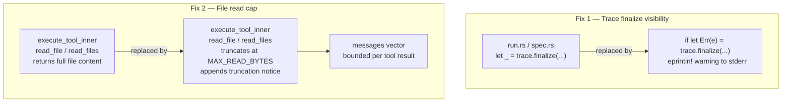

# Run Stability: Trace Finalize Visibility and File Read Truncation

## Raw Requirement

> Issue 1: No traces — silent failure
> The .moeb/traces/ directory has never been created. The cause is this pattern in both run.rs:137
> and spec.rs:145,150:
>
>     let _ = trace.finalize(outcome, err_msg);
>
> finalize can fail (e.g. if create_dir_all hits a permissions issue, or the spec slug contains a
> character that's invalid in a Windows filename), and the error is silently dropped. This needs to
> at least emit a warning to stderr so the failure is visible.
>
> Issue 2: Hangs mid-run — unbounded context growth
> The actual hang isn't in the local file read — that's synchronous and fast. The hang is in the
> subsequent API call after a large file read, because:
>
> - Every read_file/read_files result is appended to messages in agent.rs:203-207
> - There are no size limits on what execute_tool_inner returns — a 100 KB source file returns in full
> - The entire messages vector is sent on every turn — by turn 5-10 with several large reads, the
>   payload can easily exceed 200-300 KB and tens of thousands of tokens
> - The API call doesn't hang because of the file read; it hangs because it's now processing a huge
>   payload
>
> Proposed fixes (provider-agnostic)
> Quick (both fixes are independent of provider):
>
> Fix the trace silent failure — replace let _ = with an eprintln! warning so failures surface
> immediately. We can also then diagnose whether there's a Windows path issue with the spec slug.
>
> Cap file read results — add a MAX_READ_BYTES constant (e.g. 100 KB) in execute_tool_inner and
> truncate with a visible notice: [... truncated: 45,231 of 120,048 chars shown ...]. This is the
> most impactful change for the hang — it bounds how large any single tool result can be, which
> limits context growth.

## Description

Two targeted stability fixes for `moeb run` and `moeb spec`.

**Fix 1 — Visible trace finalize failure.** In `src/moeb/src/domain/run.rs` (line 137) and
`src/moeb/src/domain/spec.rs` (lines 145 and 150), `TraceContext::finalize` is called with its
`Result` discarded via `let _ = ...`. The `finalize` method creates `.moeb/traces/`, serialises the
trace envelope, and writes the JSON file — any of these steps can fail on Windows due to path
character restrictions in the spec slug, directory permission issues, or a full disk. The fix
replaces the three `let _ = ...` calls with an `if let Err` guard that prints a `[moeb] warning:
trace could not be saved: <error>` line to stderr. The agent run itself is not aborted; the warning
is purely informational. This makes the root cause of missing traces immediately diagnosable.

**Fix 2 — File read result cap.** In `src/moeb/src/agent.rs`, `execute_tool_inner` returns the
complete contents of any file read by the `read_file` or `read_files` tools. These results are
pushed onto the `messages` vector and re-sent in their entirety on every subsequent turn, causing
unbounded context growth. The fix adds a `MAX_READ_BYTES: usize` constant (100 KiB = 102 400 bytes)
and applies it inside both the `"read_file"` and `"read_files"` match arms. If the content of a
single file exceeds this limit, the returned string is truncated at the last UTF-8 character
boundary at or below `MAX_READ_BYTES`, followed by a truncation notice of the form:
`\n[... truncated: N of M chars shown ...]`. For `read_files`, the cap and notice are applied
independently to each file's content before it is concatenated into the combined output string.
The `MAX_READ_BYTES` limit applies only to what is returned to the agent (and therefore appended to
`messages`); it does not affect what is written to the trace by `apply_content_policy`, which
continues to receive the raw result from `execute_tool_inner` before any truncation is applied.

Wait — on reflection: `execute_tool_inner` currently returns the raw content, and `RealToolExecutor`
calls `execute_tool_inner` and then `apply_content_policy` on the raw result before tracing.
The truncation must happen *inside* `execute_tool_inner` itself, so that both the agent and the
trace see the same (capped) string. This is simpler and correct: a 100 KiB cap is safe to store in
the trace and no information is lost for replay purposes because the agent never saw the rest.



## Backlinks

### Parents

| Label | Path | Purpose |
|-------|------|---------|
| Trace Capture, Replay, and Kernel Configuration | [specifications/moeb/moeb.trace-and-replay.md](specifications/moeb/moeb.trace-and-replay.md) | Introduced `TraceContext::finalize` and the `.moeb/traces/` write path whose silent failure is fixed here |
| Agent File-Read Optimization | [specifications/moeb/moeb.agent-read-optimization.md](specifications/moeb/moeb.agent-read-optimization.md) | Added `read_files` batch tool alongside `read_file`; both are subject to the read cap introduced here |
| Moeb Kernel | [specifications/moeb/moeb.kernel.md](specifications/moeb/moeb.kernel.md) | Established `execute_tool_inner` and the agent loop whose unbounded message accumulation is bounded here |

### External

*(none)*

## Steps

### Step 1 — Replace `let _ = trace.finalize(...)` in `src/moeb/src/domain/run.rs`

In `src/moeb/src/domain/run.rs`, line 137 currently reads:

```rust
let _ = trace.finalize(outcome, err_msg);
```

Replace it with:

```rust
if let Err(e) = trace.finalize(outcome, err_msg) {
    eprintln!("[moeb] warning: trace could not be saved: {}", e);
}
```

No other changes to `run.rs` are required.

### Step 2 — Replace `let _ = trace.finalize(...)` in `src/moeb/src/domain/spec.rs`

In `src/moeb/src/domain/spec.rs`, two lines use the same silent-drop pattern.

Line 145 (inside the failure branch after the retry loop is exhausted):

```rust
let _ = trace.finalize(TraceOutcome::Failure, Some(last_err.to_string()));
```

Replace with:

```rust
if let Err(e) = trace.finalize(TraceOutcome::Failure, Some(last_err.to_string())) {
    eprintln!("[moeb] warning: trace could not be saved: {}", e);
}
```

Line 150 (inside the success branch after the retry loop breaks):

```rust
let _ = trace.finalize(TraceOutcome::Success, None);
```

Replace with:

```rust
if let Err(e) = trace.finalize(TraceOutcome::Success, None) {
    eprintln!("[moeb] warning: trace could not be saved: {}", e);
}
```

No other changes to `spec.rs` are required.

### Step 3 — Add `MAX_READ_BYTES` constant and truncation helper in `src/moeb/src/agent.rs`

At the top of `src/moeb/src/agent.rs`, alongside the existing `MAX_TURNS` constant, add:

```rust
const MAX_READ_BYTES: usize = 102_400; // 100 KiB per file read result
```

Below the existing constants, add a private helper function:

```rust
fn truncate_to_byte_limit(content: String, limit: usize) -> String {
    if content.len() <= limit {
        return content;
    }
    // Find the last UTF-8 character boundary at or below `limit`.
    let mut boundary = limit;
    while boundary > 0 && !content.is_char_boundary(boundary) {
        boundary -= 1;
    }
    let total = content.len();
    let shown = boundary;
    format!(
        "{}\n[... truncated: {} of {} chars shown ...]",
        &content[..boundary],
        shown,
        total
    )
}
```

### Step 4 — Apply the cap in the `"read_file"` arm of `execute_tool_inner`

In `execute_tool_inner`, the `"read_file"` arm currently returns:

```rust
"read_file" => {
    let rel = args["path"].as_str().context("read_file: missing 'path'")?;
    let full = working_dir.join(rel);
    fs::read_to_string(&full)
        .with_context(|| format!("read_file: cannot read {}", full.display()))
}
```

Replace with:

```rust
"read_file" => {
    let rel = args["path"].as_str().context("read_file: missing 'path'")?;
    let full = working_dir.join(rel);
    let content = fs::read_to_string(&full)
        .with_context(|| format!("read_file: cannot read {}", full.display()))?;
    Ok(truncate_to_byte_limit(content, MAX_READ_BYTES))
}
```

### Step 5 — Apply the cap in the `"read_files"` arm of `execute_tool_inner`

In `execute_tool_inner`, the `"read_files"` arm currently appends full file content:

```rust
Ok(content) => {
    out.push_str(&format!("=== {} ===\n{}\n\n", rel, content));
}
```

Replace that line with:

```rust
Ok(content) => {
    let capped = truncate_to_byte_limit(content, MAX_READ_BYTES);
    out.push_str(&format!("=== {} ===\n{}\n\n", rel, capped));
}
```

The cap applies independently to each file; `MAX_READ_BYTES` is not a cap on the total combined
output of a `read_files` call.

### Step 6 — Add unit tests

Add the following tests to the `#[cfg(test)]` module in `src/moeb/src/agent.rs`:

**`truncate_to_byte_limit_passes_short_content`**: call `truncate_to_byte_limit` with a string
shorter than `MAX_READ_BYTES`; assert the returned string equals the input exactly.

**`truncate_to_byte_limit_truncates_long_content`**: call `truncate_to_byte_limit` with a string
of `MAX_READ_BYTES + 1000` bytes (ASCII 'x' repeated); assert:
- the returned string length is less than or equal to `MAX_READ_BYTES + 80` (room for the notice),
- the returned string contains `"[... truncated:"`,
- the returned string contains `"of"` followed by the total character count.

**`read_file_truncates_large_file`**: in a temp dir, write a file containing
`MAX_READ_BYTES + 1000` 'x' characters; call
`execute_tool_inner("read_file", &json!({"path": "big.txt"}), tmp.path())`; assert:
- the returned `Ok(s)` contains `"[... truncated:"`,
- `s.len() < MAX_READ_BYTES + 200`.

**`read_files_truncates_each_file_independently`**: write two files each with
`MAX_READ_BYTES + 500` bytes; call `execute_tool_inner("read_files", ...)` with both paths;
assert the combined output contains exactly two `"[... truncated:"` occurrences and both
`=== file1.txt ===` and `=== file2.txt ===` section headers.

**`read_file_does_not_truncate_exact_limit`**: write a file of exactly `MAX_READ_BYTES` bytes;
assert the result does not contain `"[... truncated:"`.

## Decisions

### Decision 1 — Warn on finalize failure without aborting the command

**Rationale:** The agent run has already completed (succeeded or failed) at the point `finalize` is
called. Aborting with an error code because a trace file could not be written would make the command
appear to fail even when the agent produced correct output and all file writes succeeded. A warning
to stderr is sufficient: it makes the failure visible and diagnosable without changing the command's
exit code or the result perceived by the user.

**Alternatives:**

| Option | Reason Rejected |
|--------|-----------------|
| Propagate the error with `?`, failing the command | Command would exit non-zero when the run itself succeeded; confusing and incorrect |
| Keep `let _ = ...`, add no output | The existing silent failure is exactly the bug being fixed; it provides no diagnostic signal |
| Write a structured error event to a fallback location | Overengineered; a single `eprintln!` is sufficient and has no failure modes of its own |

**Consequences:** All three `finalize` call sites in `run.rs` and `spec.rs` must use the
`if let Err` pattern. Any future `finalize` call sites added by later specifications must do the
same.

---

### Decision 2 — Cap at 100 KiB per file read, not per turn or per session

**Rationale:** A per-file cap is the simplest intervention that bounds the size of any single
`ToolResult` message appended to the conversation. A per-turn or per-session cap would require
tracking cumulative context size across turns, which is more complex and interacts with existing
logic. A 100 KiB ceiling is large enough to cover the vast majority of source files, configuration
files, and documentation files that an agent would legitimately need to inspect; it is small enough
to prevent any single read from exceeding a few thousand tokens.

**Alternatives:**

| Option | Reason Rejected |
|--------|-----------------|
| Per-turn context cap with oldest tool results dropped | Architecturally more involved; deferred to a future context-pruning specification |
| Per-session cap (stop reading once total messages reach N bytes) | Hard to implement cleanly; requires intrusive changes to the agent loop |
| No cap; rely on prompt caching to reduce cost | Caching reduces cost but not latency; a 300 KB payload still takes longer to process regardless of caching |
| 10 KiB cap | Too small; would truncate typical source files and reduce agent effectiveness |
| 1 MiB cap | Too large; does not meaningfully bound context growth |

**Consequences:** Any file larger than 100 KiB will be delivered to the agent in truncated form.
The agent may need to request a specific byte range or line range in future if it requires content
beyond the cap; the current tool surface has no range-read capability, which is acceptable for now.

---

### Decision 3 — Apply cap inside `execute_tool_inner`, not in `RealToolExecutor`

**Rationale:** `execute_tool_inner` is the single function responsible for producing tool output
strings. Applying the cap there ensures the returned string is already bounded before it is handed
to `RealToolExecutor::execute`, to `apply_content_policy`, and to the `messages` accumulator.
This means the trace and the agent both see the same truncated content, with no possibility of
divergence. Applying the cap in `RealToolExecutor` instead would mean `execute_tool_inner` still
returns an unbounded string that `apply_content_policy` must hash in full before the cap is applied
— a wasted allocation for large files.

**Alternatives:**

| Option | Reason Rejected |
|--------|-----------------|
| Cap in `RealToolExecutor` after calling `execute_tool_inner` | Trace would reflect the truncated result but `apply_content_policy` would hash the full content; divergence between agent view and trace |
| Cap only in the agent loop before `messages.push` | Requires changing the agent loop and duplicating the truncation logic at every tool-result push site |

**Consequences:** `execute_tool_inner` is now the source of truth for bounded tool output. The
`truncate_to_byte_limit` helper must be kept private to `agent.rs`. Future read-like tools added
in this codebase should apply `truncate_to_byte_limit` to their output.

---

### Decision 4 — Truncation notice format: `[... truncated: N of M chars shown ...]`

**Rationale:** The notice must be machine-recognisable (so tests can assert on it) and
human-readable (so the agent can understand that content was omitted). Including the shown and
total character counts gives the agent enough information to reason about how much was omitted
without requiring it to count bytes itself.

**Alternatives:**

| Option | Reason Rejected |
|--------|-----------------|
| `[FILE TRUNCATED]` (no counts) | Agent cannot tell whether 1 byte or 100 KB was omitted |
| Truncate silently with no notice | Agent would not know the file was larger; could make incorrect assumptions about completeness |
| Return an error instead of truncating | Would cause the agent loop to treat the read as failed and retry; not the right semantics |

**Consequences:** The exact notice format `[... truncated: N of M chars shown ...]` is now part of
the observable contract between `execute_tool_inner` and callers. Tests assert on this string.
Any future change to the format must be reflected in tests and any agent prompts that reference it.

## Rubric

### Structured

| Name | Description | Threshold | Pass Condition |
|------|-------------|-----------|----------------|
| Binary builds | `cargo build --release` completes without errors | Zero errors | CI build exits 0 |
| Trace finalize warning emitted | When `finalize` fails, a `[moeb] warning: trace could not be saved:` line appears on stderr | Warning present | Unit test: inject a failing `finalize` call; assert stderr contains the warning |
| Run does not abort on finalize failure | `moeb run` exits 0 when the run succeeds, even if `finalize` fails | Exit code 0 | Unit test: `RunService::run` with a trace dir that is not writable returns `Ok(())` |
| read_file truncates at 100 KiB | Files larger than `MAX_READ_BYTES` are truncated with notice | Result contains `[... truncated:` | Unit test `read_file_truncates_large_file` |
| read_file does not truncate at limit | Files of exactly `MAX_READ_BYTES` bytes are returned unmodified | No truncation notice | Unit test `read_file_does_not_truncate_exact_limit` |
| read_files truncates each file independently | Both files in a two-file read are individually capped | Two truncation notices | Unit test `read_files_truncates_each_file_independently` |
| Short content is never modified | Files below the cap pass through unchanged | Input equals output | Unit test `truncate_to_byte_limit_passes_short_content` |
| Truncation notice includes counts | Notice contains total character count | `of <total>` present | Unit test `truncate_to_byte_limit_truncates_long_content` |

### Qualitative

- **Truncation notice is agent-legible.** The notice appended to truncated content must clearly
  convey that more content exists and state how many characters were omitted. An agent reading only
  the tool result must understand it received a partial file without consulting documentation.
- **No regression on existing commands.** `moeb run`, `moeb spec`, `moeb replay`, and all other
  commands must produce identical behaviour for files under the cap. The only observable change for
  normal-sized files is the warning emitted if `finalize` fails.
- **Warning message is actionable.** The `[moeb] warning: trace could not be saved:` message must
  include the underlying error text so a user can immediately identify whether the cause is a
  permissions issue, a path character restriction, or a disk-full condition, without needing to
  attach a debugger or run with verbose logging.
