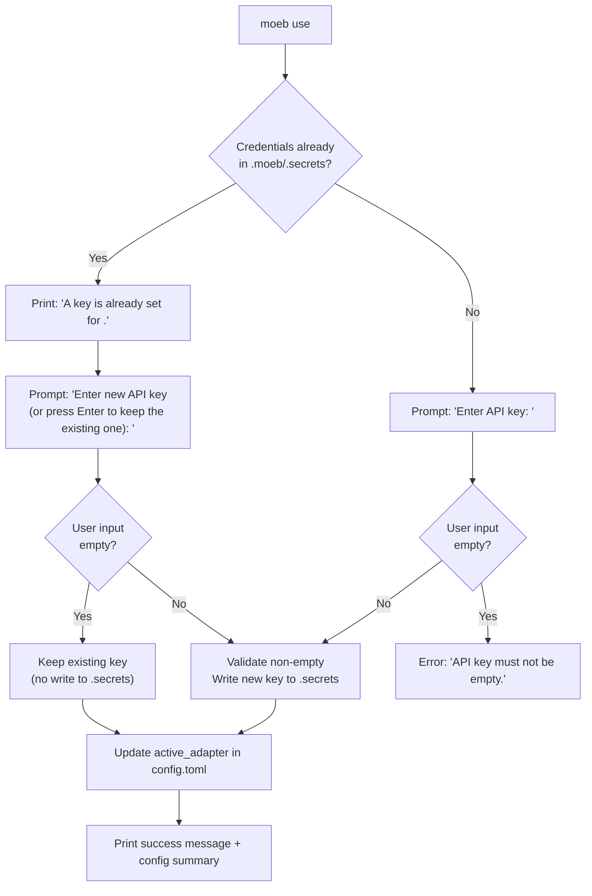

# Use Configured Adapter Without Re-entering Credentials

## Raw Requirement

> given an adapter is already configured i.e. has the required secret key etc. then calling moeb use
> <adapter> should switch to that adapter as being active without requesting the secret be set again /
> allow for press enter to use current secret (if this is an option it should state that this is the
> case to the user)

## Description

`moeb use <adapter>` currently always prompts the user for an API key, even when credentials for
that adapter are already stored in `.moeb/.secrets`. This causes unnecessary friction when the user
simply wants to switch the active adapter to one that is already configured.

The command is updated so that when an adapter's secret key is already present in `.moeb/.secrets`:

- The user is told that a key is already set.
- The prompt reads: `"Enter new API key (or press Enter to keep the existing one): "`.
- If the user presses Enter (submits an empty string), the existing key is left in place and only
  `active_adapter` in `.moeb/config.toml` is updated.
- If the user types a new key and presses Enter, that key replaces the existing one exactly as
  before.

When no credentials are stored, the behaviour is unchanged: the prompt does not mention any
existing key, and an empty submission is rejected with an actionable error.

Both per-adapter configure functions (`configure_openai` and `configure_anthropic`) are updated
identically. The config-summary printout that follows a successful `moeb use` call is unchanged.

## Diagram



## Backlinks

### Parents

| Label | Path | Purpose |
|-------|------|---------|
| Moeb Kernel | [specifications/moeb/moeb.kernel.md](specifications/moeb/moeb.kernel.md) | Establishes `moeb use <adapter>`, `.moeb/.secrets` storage, and the adapter activation flow |
| Adapter Configuration, Release, and Listing | [specifications/moeb/moeb.adapter-config-and-listing.md](specifications/moeb/moeb.adapter-config-and-listing.md) | Defines per-adapter config in `config.toml` and the config summary printed after `moeb use` |
| Anthropic Claude Adapter | [specifications/moeb/moeb.anthropic-adapter.md](specifications/moeb/moeb.anthropic-adapter.md) | Adds `configure_anthropic` alongside `configure_openai`; both are modified by this spec |

### External

*(none)*

## Steps

### Step 1 — Extract a `credential_key_for` helper in `use_cmd.rs`

In `src/moeb/src/commands/use_cmd.rs`, add a small pure function that maps an adapter name to its
secret key name:

```rust
fn credential_key_for(adapter: &str) -> &'static str {
    match adapter {
        "openai" => "OPENAI_API_KEY",
        "anthropic" => "ANTHROPIC_API_KEY",
        _ => unreachable!("caller validates adapter name"),
    }
}
```

This avoids repeating the mapping in both `configure_openai` and `configure_anthropic` and makes
a later addition of further adapters straightforward.

### Step 2 — Extract a shared `configure_adapter` function

Replace the two near-identical `configure_openai` and `configure_anthropic` bodies with a single
generic helper:

```rust
fn configure_adapter(
    adapter: &str,
    secret_key: &str,
    print_summary: fn(&MoebConfig),
) -> Result<()> {
    let secrets = Secrets::load()?;
    let already_configured = secrets.get(secret_key).is_some();

    let new_key = if already_configured {
        println!("A key is already set for {}.", adapter);
        prompt_password(&format!(
            "Enter new API key (or press Enter to keep the existing one): "
        ))
        .context("Failed to read API key")?
    } else {
        prompt_password(&format!("Enter {} API key: ", adapter_display_name(adapter)))
            .context("Failed to read API key")?
    };

    let trimmed = new_key.trim();

    if trimmed.is_empty() {
        if already_configured {
            // User accepted the existing key — nothing to write to secrets.
        } else {
            anyhow::bail!("API key must not be empty.");
        }
    } else {
        let mut secrets = Secrets::load()?;
        secrets.set(secret_key, trimmed)?;
    }

    let mut config = MoebConfig::load()?;
    config.active_adapter = Some(adapter.to_string());
    config.save()?;

    println!("{} adapter configured.", adapter_display_name(adapter));
    print_summary(&config);
    Ok(())
}
```

Add a small display-name helper so "openai" renders as "OpenAI" and "anthropic" as "Anthropic" in
user-facing messages:

```rust
fn adapter_display_name(adapter: &str) -> &'static str {
    match adapter {
        "openai" => "OpenAI",
        "anthropic" => "Anthropic",
        _ => adapter,
    }
}
```

### Step 3 — Update `configure_openai` and `configure_anthropic` to use the shared helper

Replace their bodies:

```rust
fn configure_openai() -> Result<()> {
    configure_adapter("openai", credential_key_for("openai"), print_openai_config_summary)
}

fn configure_anthropic() -> Result<()> {
    configure_adapter("anthropic", credential_key_for("anthropic"), print_anthropic_config_summary)
}
```

The `print_openai_config_summary` and `print_anthropic_config_summary` functions remain unchanged.

### Step 4 — Add unit tests

In `src/moeb/src/commands/use_cmd.rs` or a sibling test module, add the following tests using a
temporary directory with a `.moeb/` subtree:

- `use_openai_without_existing_key_requires_non_empty_input`: in a fresh `.moeb/` with no
  `.secrets`, assert that calling the configure logic with an empty key returns an error containing
  "must not be empty".

- `use_openai_with_existing_key_empty_input_keeps_key`: seed `.moeb/.secrets` with
  `OPENAI_API_KEY=sk-existing`; simulate the user submitting an empty string; assert that
  `.moeb/.secrets` still contains `OPENAI_API_KEY=sk-existing` and `active_adapter = "openai"` is
  set in `config.toml`.

- `use_openai_with_existing_key_new_input_replaces_key`: seed `.moeb/.secrets` with
  `OPENAI_API_KEY=sk-old`; simulate submitting `sk-new`; assert `.moeb/.secrets` contains
  `OPENAI_API_KEY=sk-new`.

- `use_anthropic_without_existing_key_requires_non_empty_input`: same pattern for Anthropic.

- `use_anthropic_with_existing_key_empty_input_keeps_key`: same pattern for Anthropic.

Because `rpassword::prompt_password` requires a TTY and cannot be injected directly in unit tests,
the shared `configure_adapter` function must accept the new-key string as a parameter (or accept a
closure/callback for reading the key) so tests can supply it without a terminal. The public surface
of `run(adapter)` is unchanged — it constructs the callback from `rpassword::prompt_password` and
passes it through.

Concretely, refactor the signature to:

```rust
fn configure_adapter(
    adapter: &str,
    secret_key: &str,
    read_key: impl Fn(&str) -> Result<String>,
    print_summary: fn(&MoebConfig),
) -> Result<()>
```

where the `read_key` closure receives the prompt string and returns the raw (untrimmed) input.
`configure_openai` and `configure_anthropic` pass `|prompt| prompt_password(prompt).map_err(Into::into)`.
Tests pass a closure that returns a predetermined string.

## Decisions

### Decision 1 — Retain the prompt rather than silently skipping it when credentials exist

**Rationale:** Silently skipping the prompt when credentials exist would make `moeb use openai` a
pure "set active adapter" command in that case, but it would offer no way to update the key in the
same invocation. The prompt-with-Enter-to-keep pattern gives users both paths (switch only, or
update and switch) in a single discoverable interaction that is self-documenting through the prompt
text.

**Alternatives:**

| Option | Reason Rejected |
|--------|-----------------|
| Skip prompt entirely when credentials exist; add a separate `moeb use openai --update-key` flag | Increases CLI surface; users who want to update the key must discover the flag |
| Mask and echo the first/last two characters of the stored key in the prompt | Exposes partial credential in terminal history and screen recordings |

**Consequences:** The prompt text must clearly state that Enter keeps the existing key. A user
reading only the prompt line will understand the full set of options without consulting help text.

---

### Decision 2 — Inject the key-reading function via a closure for testability

**Rationale:** `rpassword::prompt_password` requires a real TTY and cannot be called in unit
tests. Injecting the read function as a closure allows the shared helper to be fully tested without
a terminal dependency and without introducing a trait or mock object.

**Alternatives:**

| Option | Reason Rejected |
|--------|-----------------|
| Use a global or thread-local override for the key reader | Hidden state; harder to reason about in concurrent test runs |
| Test only via integration test with a pseudo-TTY | Complex platform-specific setup; not portable to CI on all platforms |

**Consequences:** `configure_adapter` is an internal function whose signature includes a
`read_key` closure. The public `run(adapter)` entry point is unchanged. Any future adapter
additions must pass an appropriate `read_key` implementation.

## Rubric

### Structured

| Name | Description | Threshold | Pass Condition |
|------|-------------|-----------|----------------|
| Binary builds | `cargo build --release` completes without error after all changes | Zero errors | CI build step exits 0 |
| Fresh configuration still requires non-empty key | Running `moeb use openai` with no prior credentials and submitting an empty key exits non-zero with a "must not be empty" error | Error message present, exit non-zero | Unit test `use_openai_without_existing_key_requires_non_empty_input` passes |
| Existing credentials — Enter keeps key | When `OPENAI_API_KEY` exists and the user submits an empty string, the secret in `.secrets` is unchanged and `active_adapter` is set | Secret unchanged; adapter active | Unit test `use_openai_with_existing_key_empty_input_keeps_key` passes |
| Existing credentials — new input replaces key | When `OPENAI_API_KEY` exists and the user submits a new non-empty key, `.secrets` is updated with the new value | New key present in `.secrets` | Unit test `use_openai_with_existing_key_new_input_replaces_key` passes |
| Anthropic parity | Both tests above pass for the Anthropic adapter | Both pass | Unit tests for Anthropic variants pass |
| Prompt text informs user of Enter option | When credentials exist, the prompt string contains the phrase "press Enter to keep the existing one" | Phrase present | Assertion on the prompt string passed to `read_key` in unit test |

### Qualitative

- **Self-documenting prompt:** A user who has never read documentation must be able to understand
  from the prompt text alone that pressing Enter will retain the existing key. The phrase "press
  Enter to keep the existing one" or equivalent must appear verbatim in the prompt.
- **No credential leakage:** The existing key must never be printed or echoed in any form — not
  masked, not truncated, not hinted — in terminal output or the prompt string.
- **Consistent style:** The informational line printed before the prompt ("A key is already set
  for openai.") must follow the existing prose style of moeb success and status messages: plain
  English, no emoji, sentence case.
