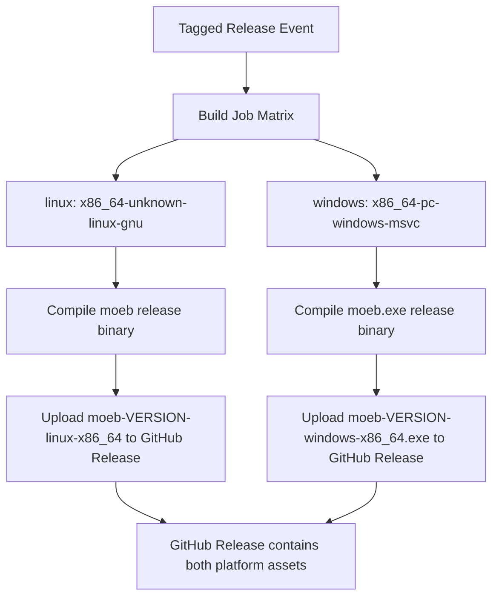

# Windows Release Target

## Raw Requirement

We need to be able to release for windows as well as linux

## Description

This specification extends the existing GitHub Actions release workflow (established in `moeb.binary-release-and-semver.md`) to produce and publish release artifacts for Windows in addition to the existing Linux target. The workflow must cross-compile or natively build the moeb binary for `x86_64-pc-windows-msvc`, upload the resulting `.exe` artifact to the same GitHub release as the Linux binary, and name both assets consistently so consumers can identify them by platform and semantic version. No changes to the moeb source code are expected beyond any platform-conditional compilation issues that surface during a Windows build.

## Backlinks

### Parents

| Label | Path | Purpose |
|-------|------|---------|
| README | [README.md](../../README.md) | Root harness policy document and specification index |
| Binary Release and Semantic Versioning | [specifications/moeb/moeb.binary-release-and-semver.md](specifications/moeb/moeb.binary-release-and-semver.md) | Parent spec establishing the GitHub Actions release workflow and semver versioning; this spec extends its build matrix |

### External

| Label | URL | Purpose |
|-------|-----|---------|
| GitHub Actions matrix strategy | https://docs.github.com/en/actions/using-jobs/using-a-matrix-for-your-jobs | Reference for build matrix configuration |
| Rust platform support — x86_64-pc-windows-msvc | https://doc.rust-lang.org/nightly/rustc/platform-support.html | Tier 1 target documentation confirming stable toolchain availability |

## Steps

1. **Audit the existing release workflow for matrix readiness**  
   Read the current file at `.github/workflows/release.yml` (or equivalent). Identify the steps that configure the Rust toolchain, compile the binary, and upload the release asset. Determine whether the job already uses a matrix strategy or is a single-platform job that must be refactored.

2. **Introduce a build matrix covering Linux and Windows**  
   Update the release workflow to use a `strategy.matrix` block with two entries:
   - `{ os: ubuntu-latest, target: x86_64-unknown-linux-gnu, artifact_suffix: linux-x86_64, binary_name: moeb }`
   - `{ os: windows-latest, target: x86_64-pc-windows-msvc, artifact_suffix: windows-x86_64, binary_name: moeb.exe }`

   Each matrix entry must run on the matching `runs-on` value (`ubuntu-latest` or `windows-latest`).

3. **Add the Windows Rust target to the toolchain setup step**  
   In the toolchain installation step, use `rustup target add ${{ matrix.target }}` (or set `targets:` in the `dtolnay/rust-toolchain` action) so the correct cross-compile target is installed automatically for each matrix leg.

4. **Compile with the correct target triple**  
   Change the `cargo build --release` invocation to `cargo build --release --target ${{ matrix.target }}`. The compiled output will be located at `target/${{ matrix.target }}/release/${{ matrix.binary_name }}`.

5. **Name release assets consistently by platform and version**  
   Derive the asset name as `moeb-<version>-<artifact_suffix>` with the `.exe` extension present on the Windows leg. Use the repository tag (e.g. `${{ github.ref_name }}`) as the version component. The upload step must reference the platform-specific binary path and asset name from the matrix variables.

6. **Upload both artifacts to the same GitHub Release**  
   Configure the upload-artifact or release-upload step so that both the Linux and Windows binaries are attached to the same release event. Verify that asset names are unique within the release (they will be, because the suffix differs).

7. **Verify the workflow end-to-end on a dry-run tag**  
   Push a pre-release tag (e.g. `v0.0.0-test`) to a feature branch or the main branch and confirm that: the matrix produces two parallel jobs, both jobs complete successfully, and both assets appear on the resulting GitHub release draft. Delete the test release and tag after verification.

8. **Fix any Windows-specific compilation failures**  
   If `cargo build --release --target x86_64-pc-windows-msvc` fails due to platform-conditional code, missing `cfg` guards, or Windows-incompatible crate features, resolve those failures in `src/` with minimal, targeted changes. Document any source-level changes in commit messages and reference this specification.

## Decisions

### Decision 1 — Extend the existing release workflow with a build matrix rather than creating a separate workflow

**Rationale:** Using a matrix strategy on the existing release workflow keeps both platform builds coupled to the same trigger event, the same release object, and the same versioning logic. A separate Windows workflow would duplicate trigger and versioning logic and could allow the two builds to diverge or produce artifacts attached to different releases.

**Alternatives:**

| Option | Reason Rejected |
|--------|-----------------|
| Separate `release-windows.yml` workflow file | Duplicates trigger and semver logic; risks artifacts landing on different releases |
| Manual Windows build uploaded out-of-band | Not automated; violates the GitHub-Actions-based release decision in the parent spec |

**Consequences:** The release workflow file becomes a matrix job. Any future platform additions (e.g. macOS) follow the same matrix pattern.

### Decision 2 — Target `x86_64-pc-windows-msvc` as the Windows build target

**Rationale:** `x86_64-pc-windows-msvc` is a Rust Tier 1 target with full stable-toolchain support and is the standard target for Windows executables distributed as standalone binaries. It produces a native `.exe` without requiring a MinGW runtime dependency, which simplifies distribution.

**Alternatives:**

| Option | Reason Rejected |
|--------|-----------------|
| `x86_64-pc-windows-gnu` (MinGW) | Requires MinGW runtime; less conventional for standalone CLI tools distributed on Windows |
| `i686-pc-windows-msvc` (32-bit) | 32-bit is increasingly rare; 64-bit covers the dominant Windows install base |

**Consequences:** The workflow must run on `windows-latest` (which provides the MSVC toolchain) for the Windows leg. Any platform-specific code must be compatible with the MSVC target.

### Decision 3 — Name release assets using the pattern `moeb-<version>-<platform-suffix>`

**Rationale:** Including the version and platform in the asset filename allows users to download the correct binary for their platform without inspecting the release body, and avoids asset-name collisions when both binaries are attached to the same release. This extends the existing versioning convention from the parent spec without breaking it.

**Alternatives:**

| Option | Reason Rejected |
|--------|-----------------|
| Generic `moeb` / `moeb.exe` names without version or platform | Collision risk on the same release; no platform disambiguation in the filename |
| Separate release per platform | Fragments the release page and makes version correlation harder |

**Consequences:** Download URLs and CI scripts that reference release assets must use the full platform-suffixed filename. Consumers must know which suffix applies to their platform.

### Decision 4 — Build natively on `windows-latest` rather than cross-compiling from Linux

**Rationale:** GitHub Actions provides `windows-latest` hosted runners with MSVC already installed. Building natively eliminates cross-compilation toolchain complexity and avoids potential linker compatibility issues. Native builds also exercise the binary in the same environment where Windows users will run it, catching Windows-specific runtime failures earlier.

**Alternatives:**

| Option | Reason Rejected |
|--------|-----------------|
| Cross-compile from `ubuntu-latest` using `cross` or MinGW | More complex toolchain setup; potential linker issues with MSVC-targeted binaries; does not exercise Windows runtime |

**Consequences:** The Windows matrix leg incurs the startup overhead of a `windows-latest` runner, which may be marginally slower than a Linux runner. This is acceptable for a release-time workflow.

## Rubric

### Structured

| Name | Description | Threshold | Pass Condition |
|------|-------------|-----------|----------------|
| binary-builds | `cargo build --release` completes without error | Zero errors | CI build exits 0 |
| all-tests-pass | `cargo test` completes without failure | Zero failures | `cargo test` exits 0 |
| no-test-regression | All tests present before this change pass without modification to test code | Zero failures | `cargo test` exits 0; no test file edited |
| no-drift | The implementation does not violate any decision recorded in a linked parent specification | Zero contradictions | Manual review of every decision in every parent spec listed in Backlinks |
| spec-schema-compliance | All required frontmatter fields and body sections are present and correctly ordered | 100% of required fields and sections | Validation in `domain/spec.rs` exits 0 during `moeb spec` |
| both-platform-assets-published | Both the Linux and Windows release assets appear on the GitHub release | Two assets attached | GitHub release shows `moeb-<version>-linux-x86_64` and `moeb-<version>-windows-x86_64.exe` |

### Qualitative

- **Asset discoverability:** A user visiting the GitHub release page should be able to identify the correct download for their platform without reading the release body or consulting documentation.
- **Workflow simplicity:** The extended matrix workflow should remain readable; a contributor unfamiliar with the original workflow should be able to follow it without additional documentation.
- **Windows runtime correctness:** The Windows binary should execute correctly on a standard Windows 10/11 x64 machine without requiring additional runtimes, PATH configuration, or administrator privileges beyond those needed for any CLI tool.