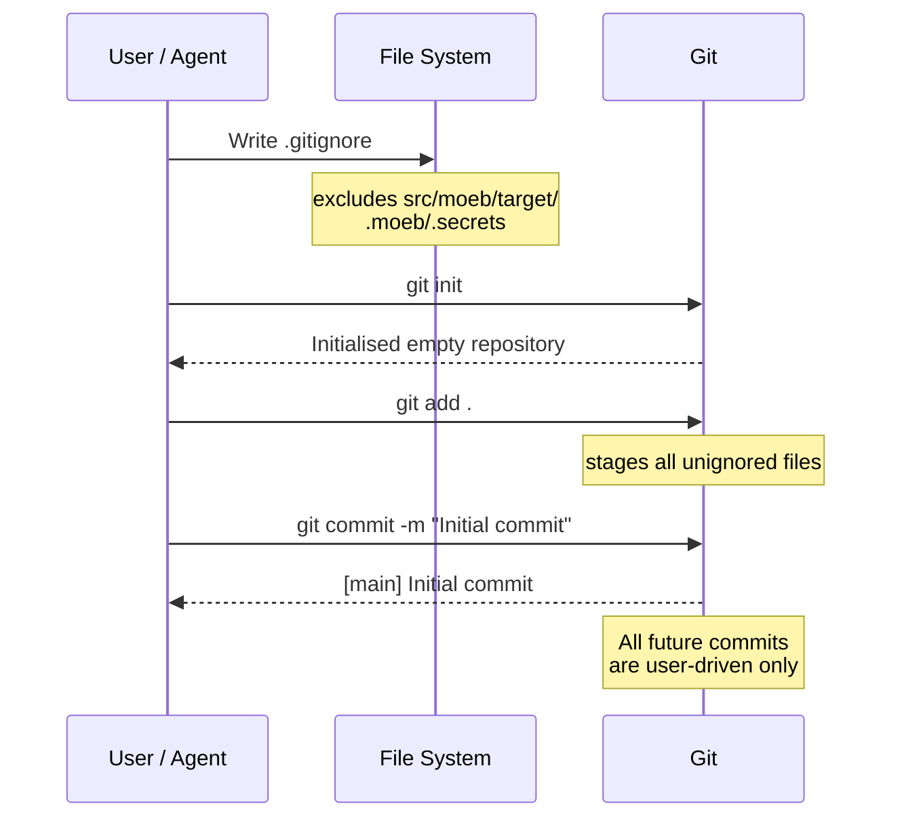

# Git Initialisation and Initial Commit

**Domain:** vcs

---

## Raw Requirement

> The overall project must be source controlled using git, we will need to initialise that and commit the current state as the initial version. For now this will be manual only i.e. after the initial commit, commits will be user driven, this may change in future specifications.

---

## Description

The project repository must be placed under git source control. A `.gitignore` must be created at the project root that excludes generated build artefacts and any secrets-bearing files before any staging occurs. All current tracked files are then staged and committed as the initial version. After this commit, all subsequent commits are user-driven — no specification, agent, or automated process may create a git commit unless a future specification explicitly authorises it. This policy is settled and binding on all downstream specifications.

---

## Diagram



---

## Backlinks

### Parents

| Label | Path | Purpose |
|-------|------|---------|
| README | [README.md](../../README.md) | Root index and policy document |
| Moeb Kernel | [harness/moeb/moeb.kernel.md](../moeb/moeb.kernel.md) | Establishes src/moeb/ as the Rust source tree whose build artefacts must be excluded |

### External

*(none)*

---

## Steps

1. **Create `.gitignore` at the project root**
   Write a `.gitignore` file at `e:\Code\Moeb\.gitignore` (the repository root) containing at minimum the following entries:

   ```
   # Rust build artefacts
   src/moeb/target/

   # Moeb secrets — must never be committed
   .moeb/.secrets
   ```

   Do not include any other entries unless they are required to exclude files that are verifiably present and must not be tracked. Do not use broad wildcard patterns that risk excluding legitimate source files.

2. **Initialise the git repository**
   Run `git init` at the project root. Accept the default branch name. Do not configure any remote at this stage.

3. **Stage all files**
   Run `git add .` at the project root. This stages every file not excluded by `.gitignore`.

4. **Verify the staged set**
   Run `git status` and confirm that no secrets files, no `src/moeb/target/` contents, and no unintended files appear in the staged set. If unexpected files appear, update `.gitignore` and re-stage before proceeding.

5. **Create the initial commit**
   Run:
   ```
   git commit -m "Initial commit"
   ```
   The commit message must be exactly `Initial commit`. No further description is required for the initial version commit.

---

## Decisions

### All commits after the initial commit are user-driven

**Rationale:** Automated commits create invisible history. A user reading `git log` must be able to trust that every commit represents a deliberate, human-reviewed checkpoint. Permitting agents to commit autonomously without explicit authorisation risks polluting the history with partial or incorrect states. The requirement explicitly calls this out as a deliberate constraint that may be revisited in a future specification.

**Alternatives:**

| Option | Reason Rejected |
|--------|----------------|
| Allow agents to commit after each specification is implemented | Agents cannot reliably judge when a change is in a committable state; partial implementations would enter history |
| Allow agents to commit with a human-approval gate | Adds workflow complexity without a clear benefit at this stage; deferred to a future spec if needed |
| Tag rather than commit for agent-produced checkpoints | Tags without commits do not record file state; not a meaningful alternative |

**Consequences:** No specification authored under this harness may include a step that creates a git commit, unless a superseding specification explicitly grants that authority. Agents implementing specifications must not run `git commit` regardless of context. This constraint is enforced by policy, not tooling, until a future spec introduces tooling enforcement.

---

### `.gitignore` excludes `src/moeb/target/` and `.moeb/.secrets` only

**Rationale:** `src/moeb/target/` is the Rust compiler output directory — large, fully reproducible from source, and inappropriate to track. `.moeb/.secrets` contains API credentials and must never enter version control under any circumstances. All other files in the repository are source artefacts that should be tracked. Using broad wildcard exclusions risks silently hiding legitimate files.

**Alternatives:**

| Option | Reason Rejected |
|--------|----------------|
| Exclude `target/` globally | Too broad; would exclude any directory named `target/` anywhere in the tree, including potential legitimate outputs |
| Exclude `.moeb/` entirely | `.moeb/` may contain tracked harness files (README.md, spec-schema.yaml, harness/) in a deployed project; excluding the whole directory is incorrect |
| Use a generated `.gitignore` from gitignore.io | Introduces opaque entries; violates the principle of including only what is verifiably needed |

**Consequences:** Any new build tool, secret file, or generated output introduced by a future specification must be accompanied by a corresponding `.gitignore` entry in that specification's steps. The `.gitignore` is not maintained as a catch-all; it is maintained entry-by-entry.

---

### Initial commit message is exactly `"Initial commit"`

**Rationale:** The initial commit has no preceding state to diff against and no specific feature to describe. A conventional, unambiguous message avoids false precision. It is immediately recognisable as the repository baseline by any reader of `git log`.

**Alternatives:**

| Option | Reason Rejected |
|--------|----------------|
| Descriptive message summarising all files | Creates maintenance burden; would need to be updated if the initial file set changes before the commit is made |
| Empty commit message | Not permitted by git without a flag; unconventional |

**Consequences:** `git log --oneline` will show `Initial commit` as the root commit. All subsequent commit messages are the user's responsibility and are not governed by this specification.

---

## Rubric

### Structured

| Name | Description | Threshold | Pass Condition |
|------|-------------|-----------|----------------|
| Repository initialised | A `.git/` directory exists at the project root | Required | `Test-Path .git` returns true |
| `.gitignore` entries present | `.gitignore` contains entries for `src/moeb/target/` and `.moeb/.secrets` | Both entries present | `Select-String` or `grep` finds both lines in `.gitignore` |
| No secrets staged | `.moeb/.secrets` does not appear in `git status` or `git ls-files` | Zero occurrences | `git ls-files .moeb/.secrets` returns empty |
| No build artefacts staged | `src/moeb/target/` contents do not appear in `git ls-files` | Zero occurrences | `git ls-files src/moeb/target/` returns empty |
| Initial commit exists | `git log` shows exactly one commit with message `Initial commit` | One commit | `git log --oneline` returns a single line containing `Initial commit` |
| Working tree clean | After the commit, `git status` reports nothing to commit | Clean | `git status --porcelain` returns empty output |

### Qualitative

- **No automated commits introduced:** A reviewer auditing all specifications in the harness must find no step in any specification that runs `git commit`, `git push`, or any equivalent git write command, unless a specification post-dating this one explicitly authorises it.
- **`.gitignore` is minimal:** The `.gitignore` must not contain entries for files or patterns that do not exist or are not relevant to this project. Each entry must be justifiable by reference to a specific file or directory present in the repository.
