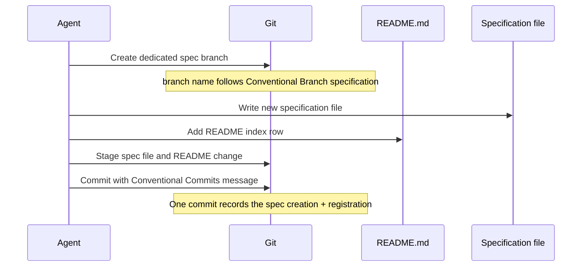

# Specification Branch and Conventional Commit for Harness Changes

## Raw Requirement

Requirement:
On creating a specification and linking in the README, we should create a separate git branch (reference https://conventional-branch.github.io/#specification for branch conventions) and commit the specification create to it, use https://www.conventionalcommits.org/en/v1.0.0/#specification for a reference on commit messages

## Description

This specification defines the version-control workflow for authoring a new harness specification and registering it in the README index. The implementation must create a dedicated git branch for the specification work, use the branch naming convention documented by Conventional Branch, and record the work in a git commit whose message follows Conventional Commits. The workflow applies only to the act of creating a new specification and adding its README index row; it does not alter the broader policy that commits are otherwise user-driven unless a future specification says so.

## Diagram

## Backlinks

### Parents

| Label | Path | Purpose |
|-------|------|---------|
| README | [README.md](../../README.md) | Root harness index and policy source |
| Git Initialisation and Initial Commit | [specifications/vcs/vcs.git-init.md](specifications/vcs/vcs.git-init.md) | Establishes the baseline git policy this specification narrows for spec-creation workflow |

### External

| Label | URL | Purpose |
|-------|-----|---------|
| Conventional Branch Specification | https://conventional-branch.github.io/#specification | Branch naming reference for specification work |
| Conventional Commits Specification | https://www.conventionalcommits.org/en/v1.0.0/#specification | Commit message reference for specification work |

## Steps

1. **Create a dedicated git branch before authoring the specification**  
   Before writing the new specification file or editing README.md, create a new git branch whose name follows the Conventional Branch specification. Use a branch name that clearly identifies the specification domain and slug, and do not reuse the main development branch for this work.

2. **Author the new specification file**  
   Create the specification under `specifications/vcs/` using the repository naming convention `<domain>.<slug>.md`. The file must contain the required frontmatter, sections, and rubric for this concern. The content must describe the branch-and-commit workflow for specification creation only.

3. **Register the specification in README.md atomically with creation**  
   Add a new row to the `### vcs` table in `README.md` during the same authoring action that creates the specification. The row must mark the specification as `active` and must not be deferred to a later task.

4. **Stage the specification and README change together**  
   Stage the new specification file and the updated README index row in the same git staging set so the registration and the specification content remain synchronised.

5. **Create a conventional commit for the specification change**  
   Commit the staged specification file and README index change using a Conventional Commits message. The message must include a valid type and a concise scope that identifies the harness/specification change, for example `docs(vcs): add specification branch and commit workflow`.

## Decisions

### Dedicated branch required for new specification authoring

**Rationale:** A separate branch isolates specification creation from unrelated work and makes the README registration and spec file change easy to review as a unit. It also aligns the harness with the branching discipline expected by the Conventional Branch specification.

**Alternatives:**

| Option | Reason Rejected |
|--------|-----------------|
| Commit directly on the current branch | Risks mixing specification authoring with unrelated changes and weakens review clarity |
| Use an ad hoc branch name without a convention | Reduces traceability and makes automation harder to standardise |
| Create the branch only after the spec is written | Fails the goal of isolating the authoring session before changes begin |

**Consequences:** Any future specification creation workflow governed by this spec must begin on a dedicated branch that follows the agreed naming convention.

### README registration must occur with specification creation

**Rationale:** The harness policy requires registration at creation, so the README index row and the specification file must be produced together. Splitting them across separate commits or tasks would create an inconsistent state in which the spec exists without an index entry or vice versa.

**Alternatives:**

| Option | Reason Rejected |
|--------|-----------------|
| Add the README row later | Violates registration-at-creation discipline and leaves the harness temporarily incomplete |
| Add the row in a separate commit | Makes the spec appear unregistered in history and complicates review |
| Skip README registration entirely | The specification would not be part of the harness index and would be non-governing |

**Consequences:** The specification file and its README index row are treated as one logical change set for authoring and commit purposes.

### Conventional Commits format is required for the specification commit

**Rationale:** A Conventional Commits message makes the change history machine- and human-readable, giving the commit a predictable structure that communicates the change class and scope. This is especially useful for harness maintenance, where commit history often serves as the audit trail for policy updates.

**Alternatives:**

| Option | Reason Rejected |
|--------|-----------------|
| Use an arbitrary commit message | Reduces traceability and weakens automation that relies on conventional history |
| Use a plain imperative summary | Lacks the structured type/scope information needed for consistent history |
| Reuse the exact initial-commit message format | Does not distinguish specification authoring work from repository bootstrap history |

**Consequences:** All commits made under this specification must follow Conventional Commits syntax, with a clear type and scope.

## Rubric

### Structured

| Name | Description | Threshold | Pass Condition |
|------|-------------|-----------|----------------|
| no-drift | No contradiction with parent specs | The implementation does not violate any decision recorded in a linked parent specification | Zero contradictions | Manual review of every decision in every parent spec listed in Backlinks |
| spec-schema-compliance | Spec conforms to schema | All required frontmatter fields and body sections are present and correctly ordered | 100% of required fields and sections | Validation in `domain/spec.rs` exits 0 during `moeb spec` |
| Branch created before authoring | A dedicated git branch is created before the specification file or README row is written | Branch exists before first file modification | `git branch --show-current` shows a non-main spec branch before any write |
| README registration is atomic | The specification file and its README index row are created as one logical authoring action | No deferred registration | Commit history shows both files changed in the same commit |
| Commit message follows Conventional Commits | The commit that records the specification change uses a valid Conventional Commits message | Valid type and scope present | `git log --format=%s -1` matches `type(scope): description` syntax |

### Qualitative

- **Branch name is convention-aligned:** The chosen branch name must clearly encode the spec domain and slug and must be recognizable as compliant with the Conventional Branch specification.
- **Commit scope is specific:** The Conventional Commits scope should identify the harness or specification concern rather than using a vague or repository-wide label.